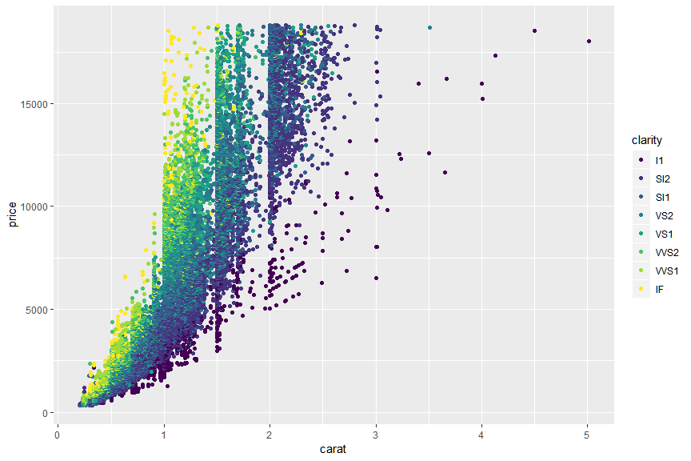

Pendahuluan
================
Muhammad Aswan Syahputra

## R Markdown

Ini merupakan dokumen R Markdown yang dapat digunakan untuk membuat
dokumen HTML, PDF, dan bahkan dokumen berekstensi .doc, .docx atau .odt.
Anda dapat membuat dokumen tulisan, salindia presentasi, dan laman web
statis maupun interaktif dengan melalui R Markdown. Penggunaan R
Markdown dalam proyek analisis data akan membuat alur kerja menjadi
lebih mudah dan *reproducible*. Informasi lebih lanjut mengenai R
Markdown dapat dilihat pada pranala [ini](http://rmarkdown.rstudio.com).

Dokumen R Markdown umumnya terdiri atas dua komponen, yaitu teks dan
kode R. Teks dapat dituliskan seperti biasa dengan menggunakan kaidah
*formatting* dokumen markdown. Silakan klik menu **Help – Markdown Quick
Reference** untuk mempelajari cara *formatting* dokumen markdown.
Sedangkan kode R harus dituliskan ke dalam bagian yang disebut dengan
*chunk*. Berikut merupakan contoh *chunk* yang berisi kode R untuk
melihat isi 6 baris pertama dataset mtcars (mtcars adalah data bawaan
yang tersedia di
    R):

``` r
head(mtcars) 
```

    ##                    mpg cyl disp  hp drat    wt  qsec vs am gear carb
    ## Mazda RX4         21.0   6  160 110 3.90 2.620 16.46  0  1    4    4
    ## Mazda RX4 Wag     21.0   6  160 110 3.90 2.875 17.02  0  1    4    4
    ## Datsun 710        22.8   4  108  93 3.85 2.320 18.61  1  1    4    1
    ## Hornet 4 Drive    21.4   6  258 110 3.08 3.215 19.44  1  0    3    1
    ## Hornet Sportabout 18.7   8  360 175 3.15 3.440 17.02  0  0    3    2
    ## Valiant           18.1   6  225 105 2.76 3.460 20.22  1  0    3    1

Anda dapat membuat *chunk* kode R dengan cara klik tombol **Insert – R**
atau melalui pemintas **Ctrl + Alt + I**. Sangat direkomendasikan untuk
memberikan nama pada *chunk* agar mempermudah akses kode R dan
mempermudah *debugging* jika terjadi galat. Anda dapat memberikan nama
pada bagian \`\`\`{r} di awal *chunk*. Perhatikan contoh penamaan
*chunk* berikut yang berisi kode R untuk melihat nilai statistik dari
dataset mtcars (Catatan: penamaan *chunk* tidak boleh menggunakan
spasi):

``` r
summary(mtcars)
```

    ##       mpg             cyl             disp             hp       
    ##  Min.   :10.40   Min.   :4.000   Min.   : 71.1   Min.   : 52.0  
    ##  1st Qu.:15.43   1st Qu.:4.000   1st Qu.:120.8   1st Qu.: 96.5  
    ##  Median :19.20   Median :6.000   Median :196.3   Median :123.0  
    ##  Mean   :20.09   Mean   :6.188   Mean   :230.7   Mean   :146.7  
    ##  3rd Qu.:22.80   3rd Qu.:8.000   3rd Qu.:326.0   3rd Qu.:180.0  
    ##  Max.   :33.90   Max.   :8.000   Max.   :472.0   Max.   :335.0  
    ##       drat             wt             qsec             vs        
    ##  Min.   :2.760   Min.   :1.513   Min.   :14.50   Min.   :0.0000  
    ##  1st Qu.:3.080   1st Qu.:2.581   1st Qu.:16.89   1st Qu.:0.0000  
    ##  Median :3.695   Median :3.325   Median :17.71   Median :0.0000  
    ##  Mean   :3.597   Mean   :3.217   Mean   :17.85   Mean   :0.4375  
    ##  3rd Qu.:3.920   3rd Qu.:3.610   3rd Qu.:18.90   3rd Qu.:1.0000  
    ##  Max.   :4.930   Max.   :5.424   Max.   :22.90   Max.   :1.0000  
    ##        am              gear            carb      
    ##  Min.   :0.0000   Min.   :3.000   Min.   :1.000  
    ##  1st Qu.:0.0000   1st Qu.:3.000   1st Qu.:2.000  
    ##  Median :0.0000   Median :4.000   Median :2.000  
    ##  Mean   :0.4062   Mean   :3.688   Mean   :2.812  
    ##  3rd Qu.:1.0000   3rd Qu.:4.000   3rd Qu.:4.000  
    ##  Max.   :1.0000   Max.   :5.000   Max.   :8.000

Saat berkerja dengan dokumen R Markdown, Anda juga dapat menjalankan
kode R yang Anda tuliskan dalam *chunk*. Anda dapat menggunakan pemintas
**Ctrl + Enter** untuk menjalankan satu baris kode R atau **Ctrl + Shift
+ Enter** untuk menjalankan semua kode R dalam sebuah *chunk*. Sekarang
buatlah *chunk* baru dengan nama ‘plot-volcano’ dengan menggunakan baris
kode R di bawah ini\! Kemudian jalankanlah baris kode R dalam *chunk*
yang telah Anda buat tersebut dengan menggunakan pemintas **Ctrl + Shift
+ Enter**\!

filled.contour(volcano, color.palette = terrain.colors, plot.title =
title(“Topografi Gunung Maunga Whau”), key.title =
title(“Tinggi(meter)”))

Setelah selesai membuat dokumen R Markdown yang berisikan teks beserta
*chunk* berisi kode R, Anda dapat klik tombol **Knit** atau pemintas
**Ctrl + Shift + K** untuk mengkonversi dokumen R Markdown menjadi
dokumen final sesuai dengan format dokumen yang diinginkan. Dokumen
final yang dihasilkan akan berisi teks, kode R, serta *output* dari kode
R yang dituliskan. Dalam contoh ini format dokumen final keluaran R
Markdown setelah menjalankan **Knit** adalah dokumen markdown (ekstensi
.md). Anda dapat mengatur format dokumen final dengan cara mengubah
baris *output* pada YAML metadata (lihat baris paling atas dokumen ini)
seperti contoh berikut:

    ---
    title: "Pendahuluan"
    author: "Muhammad Aswan Syahputra"
    date: "4/24/2019"
    output: word_document
    editor_options: 
      chunk_output_type: console
    ---

## Pengantar ggplot2

Bahasa R memiliki berbagai sistem untuk membuat grafik, contohnya base,
lattice, ggplot, dan lain-lain. Namun dalam lokakarya ini Anda akan
berfokus pada sistem ggplot saja. Sistem pembuatan grafik dengan ggplot
dapat dilakukan dengan menggunakan paket ggplot2. Anda dapat memasangnya
dengan cara menjalankan `install.packages("ggplot2")` atau melalui
`install.packages("tidyverse)"` (ggplot2 merupakan bagian dari
Tidyverse). Anda juga dapat memasang paket melalui menu **Tools –
Install Packages…** pada RStudio. Silakan pasang paket ggplot2 terlebih
dahulu jika Anda belum memasangnya.

Anda harus mengaktifkan paket terlebih dahulu untuk dapat menggunakan
fungsi-fungsi yang terdapat dalam paket tersebut. Cara mengaktifkan
paket adalah dengan cara menjalankan `library(nama_paket)` atau
`library("nama_paket")` pada *chunk* R Markdown, R Script, atau konsol
RStudio jika Anda bekerja di sesi interaktif. Ingat bahwa paket harus
selalu diaktifkan sebelum memulai sesi analisis\! Sekarang aktifkanlah
paket ggplot2 dengan cara mengganti bagian \_\_\_ dengan jawaban yang
tepat\!

``` r
library(ggplot2)
library(tidyverse)
```

Anda dapat menggunakan fungsi `qplot()` untuk membuat grafik menggunakan
ggplot2. Silakan jalankan `help(qplot)` atau `?qplot` pada konsol
RStudio untuk membuka laman dokumentasi fungsi `qplot()`. Dalam contoh
ini Anda akan membuat grafik dari dataset diamonds yang tersedia dalam
paket ggplot2. Anda dapat melihat isi serta dokumentasi dari dataset
tersebut dengan menjalankan `diamonds` dan `?diamonds` di konsol
RStudio. Setelah Anda membaca dokumentasi fungsi `qplot()` dan dataset
diamonds tersebut, isilah bagian \_\_\_ pada *chunk* berikut untuk
membuat grafik hubungan antara berat (sumbu x), harga (sumbu y) dan
kejernihan intan dari dataset
diamonds.

``` r
qplot(x = carat, y = price, colour = clarity, data = diamonds)
```



Selamat Anda telah berhasil membuat grafik pertama menggunakan ggplot2\!
Selain meggunakan fungsi `qplot()` Anda juga dapat menggunakan fungsi
`ggplot()` untuk membuat grafik. Berikut merupakan kode R untuk membuat
grafik dari dataset diamonds yang persis sama dengan grafik pada *chunk*
sebelumnya:

``` r
ggplot(data = diamonds, mapping = aes(x = carat, y = price, colour = clarity)) +
  geom_point()
```


Anda juga dapat menuliskan kode R di atas dalam bentuk seperti di bawah
ini. Dalam contoh di bawah ini juga ditunjukan bahwa Anda dapat
menyimpan keluaran dari fungsi `ggplot()` ke dalam obyek R dengan nama
plot\_diamonds dan menyimpan grafik tersebut ke komputer menggunakan
fungsi `ggsave()` (Catatan: penanda \# dalam *chunk* digunakan untuk
menuliskan komentar).

``` r
plot_diamonds <- ggplot(data = diamonds) +
  geom_point(mapping = aes(x = carat, y = price, colour = clarity)) # Saat output disimpan ke dalam obyek R, grafik tidak otomatis dicetak

plot_diamonds # Untuk mencetak grafik, Anda harus menjalankan nama obyek R yang sebelumnya dibuat
```


``` r
ggsave(filename = "diamonds.png", plot = plot_diamonds)
```

Meskipun penulisan kode R untuk membuat grafik menggunakan fungsi
`ggplot()` relatif lebih panjang, lebih banyak kostumisasi dan
pengaturan grafik yang dapat dilakukan dengan menggunakan fungsi
`ggplot()` dibandingkan fungsi `qplot()`. Dalam lokakarya ini Anda akan
diminta untuk membuat banyak grafik dengan menggunakan struktur
penulisan kode R sebagai berikut:

``` 
ggplot(data = <DATA>) +
  <GEOM_FUNCTION>(mapping = aes(<MAPPINGS>))  
```

Sekarang Anda dipersilahkan klik tombol **Knit** atau menjalankan
pemintas **Ctrl + Shift + K** untuk mengkonversi dokumen R Markdown ini
menjadi dokumen final (dokumen berekstensi .md). Kemudian silakan unggah
hasil kerja Anda ke repositori GitHub dengan cara yang akan ditunjukan
oleh instruktur. Setelah berhasil, silakan akses berkas
001\_pendahuluan.md dalam direktori vignettes di repositori GitHub milik
Anda tersebut.
