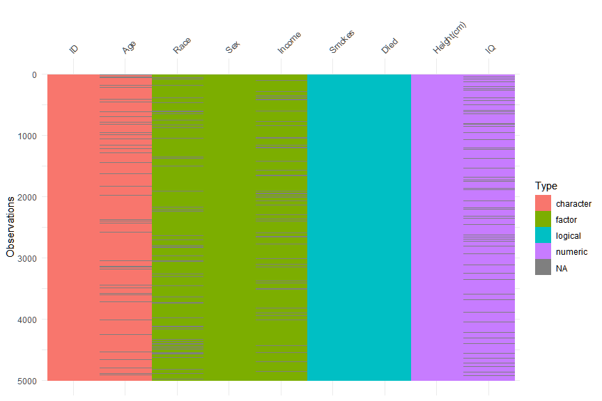

Eksplorasi dan Transformasi Data
================
Muhammad Aswan Syahputra

## Eksplorasi Data

Sebelum melakukan pembuatan grafik, Anda harus terlebih dahulu
mengetahui informasi apa yang disimpan dalam sebuah dataset. Contohnya
Anda setidaknya harus mengetahui informasi jumlah kolom/variabel, jumlah
baris/observasi, nama setiap kolom, dan jenis data setiap kolom. Di
bawah ini terdapat beberapa fungsi dasar yang tersedia di R untuk
mengetahui informasi dari sebuah dataset (dalam contoh ini Anda akan
menggunakan dataset iris). Jalankan baris kode tersebut satu per satu
menggunakan pemintas **Ctrl + Enter** dan kemudian cari informasi
mengenai tujuan penggunaan dari setiap ungsi tersebut dengan menjalankan
`help(nama_fungsi)` atau `?nama_fungsi` di konsol RStudio\! Tulislah
kegunaan dari setiap fungsi secara singkat dengan cara mengisi bagian
\_\_\_\!

``` r
iris # mencetak data di konsol
```

    ##     Sepal.Length Sepal.Width Petal.Length Petal.Width    Species
    ## 1            5.1         3.5          1.4         0.2     setosa
    ## 2            4.9         3.0          1.4         0.2     setosa
    ## 3            4.7         3.2          1.3         0.2     setosa
    ## 4            4.6         3.1          1.5         0.2     setosa
    ## 5            5.0         3.6          1.4         0.2     setosa
    ## 6            5.4         3.9          1.7         0.4     setosa
    ## 7            4.6         3.4          1.4         0.3     setosa
    ## 8            5.0         3.4          1.5         0.2     setosa
    ## 9            4.4         2.9          1.4         0.2     setosa
    ## 10           4.9         3.1          1.5         0.1     setosa
    ## 11           5.4         3.7          1.5         0.2     setosa
    ## 12           4.8         3.4          1.6         0.2     setosa
    ## 13           4.8         3.0          1.4         0.1     setosa
    ## 14           4.3         3.0          1.1         0.1     setosa
    ## 15           5.8         4.0          1.2         0.2     setosa
    ## 16           5.7         4.4          1.5         0.4     setosa
    ## 17           5.4         3.9          1.3         0.4     setosa
    ## 18           5.1         3.5          1.4         0.3     setosa
    ## 19           5.7         3.8          1.7         0.3     setosa
    ## 20           5.1         3.8          1.5         0.3     setosa
    ## 21           5.4         3.4          1.7         0.2     setosa
    ## 22           5.1         3.7          1.5         0.4     setosa
    ## 23           4.6         3.6          1.0         0.2     setosa
    ## 24           5.1         3.3          1.7         0.5     setosa
    ## 25           4.8         3.4          1.9         0.2     setosa
    ## 26           5.0         3.0          1.6         0.2     setosa
    ## 27           5.0         3.4          1.6         0.4     setosa
    ## 28           5.2         3.5          1.5         0.2     setosa
    ## 29           5.2         3.4          1.4         0.2     setosa
    ## 30           4.7         3.2          1.6         0.2     setosa
    ## 31           4.8         3.1          1.6         0.2     setosa
    ## 32           5.4         3.4          1.5         0.4     setosa
    ## 33           5.2         4.1          1.5         0.1     setosa
    ## 34           5.5         4.2          1.4         0.2     setosa
    ## 35           4.9         3.1          1.5         0.2     setosa
    ## 36           5.0         3.2          1.2         0.2     setosa
    ## 37           5.5         3.5          1.3         0.2     setosa
    ## 38           4.9         3.6          1.4         0.1     setosa
    ## 39           4.4         3.0          1.3         0.2     setosa
    ## 40           5.1         3.4          1.5         0.2     setosa
    ## 41           5.0         3.5          1.3         0.3     setosa
    ## 42           4.5         2.3          1.3         0.3     setosa
    ## 43           4.4         3.2          1.3         0.2     setosa
    ## 44           5.0         3.5          1.6         0.6     setosa
    ## 45           5.1         3.8          1.9         0.4     setosa
    ## 46           4.8         3.0          1.4         0.3     setosa
    ## 47           5.1         3.8          1.6         0.2     setosa
    ## 48           4.6         3.2          1.4         0.2     setosa
    ## 49           5.3         3.7          1.5         0.2     setosa
    ## 50           5.0         3.3          1.4         0.2     setosa
    ## 51           7.0         3.2          4.7         1.4 versicolor
    ## 52           6.4         3.2          4.5         1.5 versicolor
    ## 53           6.9         3.1          4.9         1.5 versicolor
    ## 54           5.5         2.3          4.0         1.3 versicolor
    ## 55           6.5         2.8          4.6         1.5 versicolor
    ## 56           5.7         2.8          4.5         1.3 versicolor
    ## 57           6.3         3.3          4.7         1.6 versicolor
    ## 58           4.9         2.4          3.3         1.0 versicolor
    ## 59           6.6         2.9          4.6         1.3 versicolor
    ## 60           5.2         2.7          3.9         1.4 versicolor
    ## 61           5.0         2.0          3.5         1.0 versicolor
    ## 62           5.9         3.0          4.2         1.5 versicolor
    ## 63           6.0         2.2          4.0         1.0 versicolor
    ## 64           6.1         2.9          4.7         1.4 versicolor
    ## 65           5.6         2.9          3.6         1.3 versicolor
    ## 66           6.7         3.1          4.4         1.4 versicolor
    ## 67           5.6         3.0          4.5         1.5 versicolor
    ## 68           5.8         2.7          4.1         1.0 versicolor
    ## 69           6.2         2.2          4.5         1.5 versicolor
    ## 70           5.6         2.5          3.9         1.1 versicolor
    ## 71           5.9         3.2          4.8         1.8 versicolor
    ## 72           6.1         2.8          4.0         1.3 versicolor
    ## 73           6.3         2.5          4.9         1.5 versicolor
    ## 74           6.1         2.8          4.7         1.2 versicolor
    ## 75           6.4         2.9          4.3         1.3 versicolor
    ## 76           6.6         3.0          4.4         1.4 versicolor
    ## 77           6.8         2.8          4.8         1.4 versicolor
    ## 78           6.7         3.0          5.0         1.7 versicolor
    ## 79           6.0         2.9          4.5         1.5 versicolor
    ## 80           5.7         2.6          3.5         1.0 versicolor
    ## 81           5.5         2.4          3.8         1.1 versicolor
    ## 82           5.5         2.4          3.7         1.0 versicolor
    ## 83           5.8         2.7          3.9         1.2 versicolor
    ## 84           6.0         2.7          5.1         1.6 versicolor
    ## 85           5.4         3.0          4.5         1.5 versicolor
    ## 86           6.0         3.4          4.5         1.6 versicolor
    ## 87           6.7         3.1          4.7         1.5 versicolor
    ## 88           6.3         2.3          4.4         1.3 versicolor
    ## 89           5.6         3.0          4.1         1.3 versicolor
    ## 90           5.5         2.5          4.0         1.3 versicolor
    ## 91           5.5         2.6          4.4         1.2 versicolor
    ## 92           6.1         3.0          4.6         1.4 versicolor
    ## 93           5.8         2.6          4.0         1.2 versicolor
    ## 94           5.0         2.3          3.3         1.0 versicolor
    ## 95           5.6         2.7          4.2         1.3 versicolor
    ## 96           5.7         3.0          4.2         1.2 versicolor
    ## 97           5.7         2.9          4.2         1.3 versicolor
    ## 98           6.2         2.9          4.3         1.3 versicolor
    ## 99           5.1         2.5          3.0         1.1 versicolor
    ## 100          5.7         2.8          4.1         1.3 versicolor
    ## 101          6.3         3.3          6.0         2.5  virginica
    ## 102          5.8         2.7          5.1         1.9  virginica
    ## 103          7.1         3.0          5.9         2.1  virginica
    ## 104          6.3         2.9          5.6         1.8  virginica
    ## 105          6.5         3.0          5.8         2.2  virginica
    ## 106          7.6         3.0          6.6         2.1  virginica
    ## 107          4.9         2.5          4.5         1.7  virginica
    ## 108          7.3         2.9          6.3         1.8  virginica
    ## 109          6.7         2.5          5.8         1.8  virginica
    ## 110          7.2         3.6          6.1         2.5  virginica
    ## 111          6.5         3.2          5.1         2.0  virginica
    ## 112          6.4         2.7          5.3         1.9  virginica
    ## 113          6.8         3.0          5.5         2.1  virginica
    ## 114          5.7         2.5          5.0         2.0  virginica
    ## 115          5.8         2.8          5.1         2.4  virginica
    ## 116          6.4         3.2          5.3         2.3  virginica
    ## 117          6.5         3.0          5.5         1.8  virginica
    ## 118          7.7         3.8          6.7         2.2  virginica
    ## 119          7.7         2.6          6.9         2.3  virginica
    ## 120          6.0         2.2          5.0         1.5  virginica
    ## 121          6.9         3.2          5.7         2.3  virginica
    ## 122          5.6         2.8          4.9         2.0  virginica
    ## 123          7.7         2.8          6.7         2.0  virginica
    ## 124          6.3         2.7          4.9         1.8  virginica
    ## 125          6.7         3.3          5.7         2.1  virginica
    ## 126          7.2         3.2          6.0         1.8  virginica
    ## 127          6.2         2.8          4.8         1.8  virginica
    ## 128          6.1         3.0          4.9         1.8  virginica
    ## 129          6.4         2.8          5.6         2.1  virginica
    ## 130          7.2         3.0          5.8         1.6  virginica
    ## 131          7.4         2.8          6.1         1.9  virginica
    ## 132          7.9         3.8          6.4         2.0  virginica
    ## 133          6.4         2.8          5.6         2.2  virginica
    ## 134          6.3         2.8          5.1         1.5  virginica
    ## 135          6.1         2.6          5.6         1.4  virginica
    ## 136          7.7         3.0          6.1         2.3  virginica
    ## 137          6.3         3.4          5.6         2.4  virginica
    ## 138          6.4         3.1          5.5         1.8  virginica
    ## 139          6.0         3.0          4.8         1.8  virginica
    ## 140          6.9         3.1          5.4         2.1  virginica
    ## 141          6.7         3.1          5.6         2.4  virginica
    ## 142          6.9         3.1          5.1         2.3  virginica
    ## 143          5.8         2.7          5.1         1.9  virginica
    ## 144          6.8         3.2          5.9         2.3  virginica
    ## 145          6.7         3.3          5.7         2.5  virginica
    ## 146          6.7         3.0          5.2         2.3  virginica
    ## 147          6.3         2.5          5.0         1.9  virginica
    ## 148          6.5         3.0          5.2         2.0  virginica
    ## 149          6.2         3.4          5.4         2.3  virginica
    ## 150          5.9         3.0          5.1         1.8  virginica

``` r
dim(iris) # Retrieve or set the dimension of an object.
```

    ## [1] 150   5

``` r
str(iris) # Compactly Display the Structure of an Arbitrary R Object
```

    ## 'data.frame':    150 obs. of  5 variables:
    ##  $ Sepal.Length: num  5.1 4.9 4.7 4.6 5 5.4 4.6 5 4.4 4.9 ...
    ##  $ Sepal.Width : num  3.5 3 3.2 3.1 3.6 3.9 3.4 3.4 2.9 3.1 ...
    ##  $ Petal.Length: num  1.4 1.4 1.3 1.5 1.4 1.7 1.4 1.5 1.4 1.5 ...
    ##  $ Petal.Width : num  0.2 0.2 0.2 0.2 0.2 0.4 0.3 0.2 0.2 0.1 ...
    ##  $ Species     : Factor w/ 3 levels "setosa","versicolor",..: 1 1 1 1 1 1 1 1 1 1 ...

``` r
colnames(iris) # Retrieve or set the row or column names of a matrix-like object.
```

    ## [1] "Sepal.Length" "Sepal.Width"  "Petal.Length" "Petal.Width" 
    ## [5] "Species"

``` r
head(iris) # Return the First or Last Part of an Object
```

    ##   Sepal.Length Sepal.Width Petal.Length Petal.Width Species
    ## 1          5.1         3.5          1.4         0.2  setosa
    ## 2          4.9         3.0          1.4         0.2  setosa
    ## 3          4.7         3.2          1.3         0.2  setosa
    ## 4          4.6         3.1          1.5         0.2  setosa
    ## 5          5.0         3.6          1.4         0.2  setosa
    ## 6          5.4         3.9          1.7         0.4  setosa

``` r
tail(iris) # Return the First or Last Part of an Object
```

    ##     Sepal.Length Sepal.Width Petal.Length Petal.Width   Species
    ## 145          6.7         3.3          5.7         2.5 virginica
    ## 146          6.7         3.0          5.2         2.3 virginica
    ## 147          6.3         2.5          5.0         1.9 virginica
    ## 148          6.5         3.0          5.2         2.0 virginica
    ## 149          6.2         3.4          5.4         2.3 virginica
    ## 150          5.9         3.0          5.1         1.8 virginica

``` r
summary(iris) # Object Summaries
```

    ##   Sepal.Length    Sepal.Width     Petal.Length    Petal.Width   
    ##  Min.   :4.300   Min.   :2.000   Min.   :1.000   Min.   :0.100  
    ##  1st Qu.:5.100   1st Qu.:2.800   1st Qu.:1.600   1st Qu.:0.300  
    ##  Median :5.800   Median :3.000   Median :4.350   Median :1.300  
    ##  Mean   :5.843   Mean   :3.057   Mean   :3.758   Mean   :1.199  
    ##  3rd Qu.:6.400   3rd Qu.:3.300   3rd Qu.:5.100   3rd Qu.:1.800  
    ##  Max.   :7.900   Max.   :4.400   Max.   :6.900   Max.   :2.500  
    ##        Species  
    ##  setosa    :50  
    ##  versicolor:50  
    ##  virginica :50  
    ##                 
    ##                 
    ## 

``` r
iris$Sepal.Length # ekstraksi kolom 'Sepal.Length' dari dataset iris. Jalankan help(`[`) untuk membaca dokumentasi
```

    ##   [1] 5.1 4.9 4.7 4.6 5.0 5.4 4.6 5.0 4.4 4.9 5.4 4.8 4.8 4.3 5.8 5.7 5.4
    ##  [18] 5.1 5.7 5.1 5.4 5.1 4.6 5.1 4.8 5.0 5.0 5.2 5.2 4.7 4.8 5.4 5.2 5.5
    ##  [35] 4.9 5.0 5.5 4.9 4.4 5.1 5.0 4.5 4.4 5.0 5.1 4.8 5.1 4.6 5.3 5.0 7.0
    ##  [52] 6.4 6.9 5.5 6.5 5.7 6.3 4.9 6.6 5.2 5.0 5.9 6.0 6.1 5.6 6.7 5.6 5.8
    ##  [69] 6.2 5.6 5.9 6.1 6.3 6.1 6.4 6.6 6.8 6.7 6.0 5.7 5.5 5.5 5.8 6.0 5.4
    ##  [86] 6.0 6.7 6.3 5.6 5.5 5.5 6.1 5.8 5.0 5.6 5.7 5.7 6.2 5.1 5.7 6.3 5.8
    ## [103] 7.1 6.3 6.5 7.6 4.9 7.3 6.7 7.2 6.5 6.4 6.8 5.7 5.8 6.4 6.5 7.7 7.7
    ## [120] 6.0 6.9 5.6 7.7 6.3 6.7 7.2 6.2 6.1 6.4 7.2 7.4 7.9 6.4 6.3 6.1 7.7
    ## [137] 6.3 6.4 6.0 6.9 6.7 6.9 5.8 6.8 6.7 6.7 6.3 6.5 6.2 5.9

``` r
class(iris$Species) # Object Classes
```

    ## [1] "factor"

``` r
length(iris$Petal.Width) # Length of an Object
```

    ## [1] 150

``` r
levels(iris$Species) # Levels Attributes
```

    ## [1] "setosa"     "versicolor" "virginica"

``` r
length(levels(iris$Species)) # Length of an Object
```

    ## [1] 3

``` r
unique(iris$Species) # ___
```

    ## [1] setosa     versicolor virginica 
    ## Levels: setosa versicolor virginica

``` r
length(unique(iris$Species)) # ___
```

    ## [1] 3

``` r
mean(iris$Sepal.Length) # ___
```

    ## [1] 5.843333

``` r
sd(iris$Sepal.Length) # ___
```

    ## [1] 0.8280661

``` r
median(iris$Sepal.Width) # ___
```

    ## [1] 3

``` r
sum(iris$Petal.Length) # ___
```

    ## [1] 563.7

``` r
cor(iris[, -5]) # ___
```

    ##              Sepal.Length Sepal.Width Petal.Length Petal.Width
    ## Sepal.Length    1.0000000  -0.1175698    0.8717538   0.8179411
    ## Sepal.Width    -0.1175698   1.0000000   -0.4284401  -0.3661259
    ## Petal.Length    0.8717538  -0.4284401    1.0000000   0.9628654
    ## Petal.Width     0.8179411  -0.3661259    0.9628654   1.0000000

Selain fungsi-fungsi di atas Anda juga dapat mendapat informasi mengenai
dataset dengan menggunakan fungsi `vis_dat()` dari paket `visdat` dan
fungsi `skim()` dari paket `skimr`. Pasanglah kedua paket tersebut
terlebih dahulu melalui menu **Tools – Install Packages…** jika Anda
belum memasangnya. Perhatikan contoh penggunaan fungsi `vis_dat()` dan
`skim()` pada *chunk* berikut\!

``` r
library(visdat)
library(skimr)

typical_data # mencetak dataset typical_data
```

    ## # A tibble: 5,000 x 9
    ##    ID    Race     Age   Sex    `Height(cm)`    IQ Smokes Income   Died 
    ##    <chr> <fct>    <chr> <fct>         <dbl> <dbl> <lgl>  <fct>    <lgl>
    ##  1 0001  Black    <NA>  Male           176.   110 FALSE  4334.29  FALSE
    ##  2 0002  Black    25    Male           172.    84 TRUE   16682.37 TRUE 
    ##  3 0003  Black    31    Female         174.   115 FALSE  50402.01 FALSE
    ##  4 0004  Hispanic 27    Female         172.    84 FALSE  91442.86 FALSE
    ##  5 0005  <NA>     21    Female         158.   116 FALSE  75266.05 FALSE
    ##  6 0006  White    22    Female         170.    83 FALSE  12209.71 FALSE
    ##  7 0007  White    23    Female         164.   101 FALSE  7881.54  FALSE
    ##  8 0008  Black    21    Female         166.    97 FALSE  19944.79 FALSE
    ##  9 0009  White    <NA>  Female         152.    92 FALSE  18468.09 TRUE 
    ## 10 0010  Hispanic 27    Male           180.    99 FALSE  16468.84 TRUE 
    ## # ... with 4,990 more rows

``` r
vis_dat(typical_data)
```



``` r
skim(typical_data)
```

    ## Skim summary statistics
    ##  n obs: 5000 
    ##  n variables: 9 
    ## 
    ## -- Variable type:character ---------------------------------------------------------
    ##  variable missing complete    n min max empty n_unique
    ##       Age     500     4500 5000   2   2     0       16
    ##        ID       0     5000 5000   4   4     0     5000
    ## 
    ## -- Variable type:factor ------------------------------------------------------------
    ##  variable missing complete    n n_unique
    ##    Income     500     4500 5000     4499
    ##      Race     500     4500 5000        8
    ##       Sex       0     5000 5000        2
    ##                              top_counts ordered
    ##         NA: 500, 199: 2, 330: 1, 434: 1   FALSE
    ##  Whi: 2938, His: 745, Bla: 525, NA: 500   FALSE
    ##             Fem: 2501, Mal: 2499, NA: 0   FALSE
    ## 
    ## -- Variable type:logical -----------------------------------------------------------
    ##  variable missing complete    n mean                       count
    ##      Died       0     5000 5000 0.51 TRU: 2526, FAL: 2474, NA: 0
    ##    Smokes       0     5000 5000 0.18  FAL: 4085, TRU: 915, NA: 0
    ## 
    ## -- Variable type:numeric -----------------------------------------------------------
    ##    variable missing complete    n   mean   sd    p0   p25   p50   p75
    ##  Height(cm)       0     5000 5000 175.19 9.5  140.3 168.8 175.2 181.8
    ##          IQ     500     4500 5000 100.08 9.91  60    93   100   107  
    ##   p100     hist
    ##  208.9 <U+2581><U+2581><U+2583><U+2587><U+2587><U+2585><U+2581><U+2581>
    ##  137   <U+2581><U+2581><U+2582><U+2587><U+2587><U+2583><U+2581><U+2581>

## Transformasi Data

Aktivitas pembuatan grafik tidak dapat dilepaskan dari aktivitas
transformasi data. Salah satu paket yang umum digunakan untuk melakukan
transformasi data adalah dplyr. Sekarang aktifkanlah paket tersebut
dengan cara mengganti bagian \_\_\_ dengan jawaban yang tepat\!
(Catatan: jika Anda belum memasang paket dplyr, pasanglah paket tersebut
terlebih dahulu melalui menu **Tools – Install Packages…**)

``` r
library(dplyr)
```

Terdapat beberapa fungsi utama dari paket dplyr untuk melakukan
transformasi data, diantaranya:

  - `select()` ?select
  - `filter()`
  - `arrange()`
  - `mutate()`
  - `summarise()`
  - `group_by()`

Bacalah dokumentasi masing-masing fungsi di atas dengan cara menjalankan
`help(nama_fungsi)` atau `?nama_fungsi` pada konsol RStudio. Anda juga
dapat menjalankan contoh kode R yang terdapat dalam masing-masing laman
dokumentasi dengan cara seleksi pada baris kode kemudian jalankan
pemintas **Ctrl + Enter**.

Transformasi data umumnya merupakan sebuah rangkaian yang terdiri lebih
dari satu proses. Oleh karena itu, dalam tranformasi data menggunakan
dplyr sering digunakan operator *pipe* `%>%` untuk menghubungkan antara
satu fungsi ke fungsi selanjutnya. Berikut merupakan contoh transformasi
data storms (dari paket dplyr) tanpa dan dengan menggunakan operator
*pipe*:

``` r
storms
```

    ## # A tibble: 10,010 x 13
    ##    name   year month   day  hour   lat  long status category  wind pressure
    ##    <chr> <dbl> <dbl> <int> <dbl> <dbl> <dbl> <chr>  <ord>    <int>    <int>
    ##  1 Amy    1975     6    27     0  27.5 -79   tropi~ -1          25     1013
    ##  2 Amy    1975     6    27     6  28.5 -79   tropi~ -1          25     1013
    ##  3 Amy    1975     6    27    12  29.5 -79   tropi~ -1          25     1013
    ##  4 Amy    1975     6    27    18  30.5 -79   tropi~ -1          25     1013
    ##  5 Amy    1975     6    28     0  31.5 -78.8 tropi~ -1          25     1012
    ##  6 Amy    1975     6    28     6  32.4 -78.7 tropi~ -1          25     1012
    ##  7 Amy    1975     6    28    12  33.3 -78   tropi~ -1          25     1011
    ##  8 Amy    1975     6    28    18  34   -77   tropi~ -1          30     1006
    ##  9 Amy    1975     6    29     0  34.4 -75.8 tropi~ 0           35     1004
    ## 10 Amy    1975     6    29     6  34   -74.8 tropi~ 0           40     1002
    ## # ... with 10,000 more rows, and 2 more variables: ts_diameter <dbl>,
    ## #   hu_diameter <dbl>

``` r
glimpse(storms) # alternatif dari fungsi str()
```

    ## Observations: 10,010
    ## Variables: 13
    ## $ name        <chr> "Amy", "Amy", "Amy", "Amy", "Amy", "Amy", "Amy", "...
    ## $ year        <dbl> 1975, 1975, 1975, 1975, 1975, 1975, 1975, 1975, 19...
    ## $ month       <dbl> 6, 6, 6, 6, 6, 6, 6, 6, 6, 6, 6, 6, 6, 6, 6, 6, 7,...
    ## $ day         <int> 27, 27, 27, 27, 28, 28, 28, 28, 29, 29, 29, 29, 30...
    ## $ hour        <dbl> 0, 6, 12, 18, 0, 6, 12, 18, 0, 6, 12, 18, 0, 6, 12...
    ## $ lat         <dbl> 27.5, 28.5, 29.5, 30.5, 31.5, 32.4, 33.3, 34.0, 34...
    ## $ long        <dbl> -79.0, -79.0, -79.0, -79.0, -78.8, -78.7, -78.0, -...
    ## $ status      <chr> "tropical depression", "tropical depression", "tro...
    ## $ category    <ord> -1, -1, -1, -1, -1, -1, -1, -1, 0, 0, 0, 0, 0, 0, ...
    ## $ wind        <int> 25, 25, 25, 25, 25, 25, 25, 30, 35, 40, 45, 50, 50...
    ## $ pressure    <int> 1013, 1013, 1013, 1013, 1012, 1012, 1011, 1006, 10...
    ## $ ts_diameter <dbl> NA, NA, NA, NA, NA, NA, NA, NA, NA, NA, NA, NA, NA...
    ## $ hu_diameter <dbl> NA, NA, NA, NA, NA, NA, NA, NA, NA, NA, NA, NA, NA...

``` r
# Tanpa menggunakan operator pipe %>% ----
storms1 <- select(storms, year, month, wind, pressure)
storms2 <- filter(storms1, between(year, 2000, 2015))
storms3 <- mutate(storms2, month = factor(month.name[storms2$month], levels = month.name))
storms4 <- group_by(storms3, month)
storms_nopipe <- summarise(storms4, avg_wind = mean(wind), avg_pressure = mean(pressure))
storms_nopipe
```

    ## # A tibble: 10 x 3
    ##    month     avg_wind avg_pressure
    ##    <fct>        <dbl>        <dbl>
    ##  1 January       45.7         999.
    ##  2 April         44.6         997.
    ##  3 May           36.8        1003.
    ##  4 June          39.0        1000.
    ##  5 July          48.2         999.
    ##  6 August        52.0         994.
    ##  7 September     58.3         988.
    ##  8 October       55.7         990.
    ##  9 November      56.5         990.
    ## 10 December      46.8         997.

``` r
# Mengggunakan operator pipe %>% ----
storms_pipe <- storms %>% 
  select(year, month, wind, pressure) %>% 
  filter(between(year, 2000, 2015)) %>% 
  mutate(month = factor(month.name[.$month], levels = month.name)) %>% 
  group_by(month) %>% 
  summarise(avg_wind = mean(wind), avg_pressure = mean(pressure))
storms_pipe
```

    ## # A tibble: 10 x 3
    ##    month     avg_wind avg_pressure
    ##    <fct>        <dbl>        <dbl>
    ##  1 January       45.7         999.
    ##  2 April         44.6         997.
    ##  3 May           36.8        1003.
    ##  4 June          39.0        1000.
    ##  5 July          48.2         999.
    ##  6 August        52.0         994.
    ##  7 September     58.3         988.
    ##  8 October       55.7         990.
    ##  9 November      56.5         990.
    ## 10 December      46.8         997.

``` r
identical(storms_nopipe, storms_pipe) # membandingkan dua dataset, hasilnya TRUE apabila kedua dataset persis sama
```

    ## [1] TRUE

Buatlah rangkuman tahapan-tahapan apa yang dilakukan untuk melakukan
transformasi dataset storms diatas\!

1.  
    
    -----

2.  
    
    -----

3.  
    
    -----

4.  
    
    -----

5.  
    
    -----

Sekarang Anda dipersilahkan klik tombol **Knit** atau menjalankan
pemintas **Ctrl + Shift + K** untuk mengkonversi dokumen R Markdown ini
menjadi dokumen final (dokumen berekstensi .md). Kemudian silakan unggah
hasil kerja Anda ke repositori GitHub dengan cara yang telah ditunjukan
oleh instruktur. Setelah berhasil, silakan akses berkas
002\_eksplor-transform.md dalam direktori vignettes di repositori GitHub
milik Anda tersebut.
