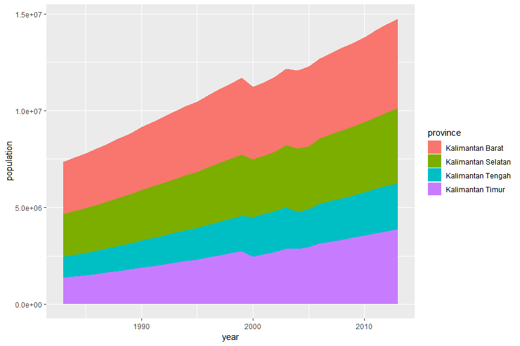

Membuat Grafik
================
Muhammad Aswan Syahputra

Paket ggplot2 adalah implementasi dari konsep *Grammar of graphic* untuk
bahasa pemrograman R. Anda dapat membaca artikel mengenai konsep
implementasi ggplot2 tersebut melalui pranala
[ini](http://vita.had.co.nz/papers/layered-grammar.pdf). Dengan memahami
konsep dari *grammar of graphic*, Anda dapat membuat berbagai jenis plot
dengan ringkas dan mudah. Mari kita perhatikan kembali struktur umum
penulisan kode R untuk membuat grafik menggunakan paket ggplot2:

``` 
ggplot(data = <DATA>) +
  <GEOM_FUNCTION>(mapping = aes(<MAPPINGS>))  
```

Anda dapat menarik kesimpulan berdasarkan struktur penulisan kode R di
atas bahwa setidaknya terdapat tiga komponen utama untuk membuat grafik,
yaitu:

  - *Data*
  - *Aesthetic mapping*
  - *Geometric object*

Sekarang Anda dipersilakan untuk mengaktifkan paket tidyverse untuk
mengimpor, mengolah, dan visualisasi data dengan cara mengisi bagian
\_\_\_ dengan jawaban yang tepat\! (Catatan: paket tidyverse berfungsi
untuk mengaktifkan paket readr, tibble, tidyr, dplyr, ggplot2, dan
purrr)

``` r
library(tidyverse)
```

Dalam contoh ini Anda akan menggunakan data *Indonesia Database for
Policy and Economic Research* dari [The World
Bank](https://datacatalog.worldbank.org/dataset/indonesia-database-policy-and-economic-research).
Data tersebut tersedia dalam berkas indodapoer.csv di dalam direktori
data-raw.

``` r
indodapoer <- read_csv("../data-raw/indodapoer.csv")
dim(indodapoer)
```

    ## [1] 22468   222

``` r
colnames(indodapoer)
```

    ##   [1] "province_or_district"                                                                                    
    ##   [2] "year"                                                                                                    
    ##   [3] "agriculture_function_expenditure_in_idr"                                                                 
    ##   [4] "average_national_exam_score_junior_secondary_level_out_of_100_available_only_in_district_level_for_2009" 
    ##   [5] "average_national_exam_score_primary_level_out_of_100_available_only_in_district_level_for_2009"          
    ##   [6] "average_national_exam_score_senior_secondary_level_out_of_100_available_only_in_district_level_for_2009" 
    ##   [7] "birth_attended_by_skilled_health_worker_in_percent_of_total_birth"                                       
    ##   [8] "bpk_audit_report_on_sub_national_budget"                                                                 
    ##   [9] "capital_expenditure_in_idr"                                                                              
    ##  [10] "consumer_price_index_in_42_cities_base_1996"                                                             
    ##  [11] "consumer_price_index_in_45_cities_base_2002"                                                             
    ##  [12] "consumer_price_index_in_66_cities_base_2007"                                                             
    ##  [13] "economy_function_expenditure_in_idr"                                                                     
    ##  [14] "education_function_expenditure_in_idr"                                                                   
    ##  [15] "environment_function_expenditure_in_idr"                                                                 
    ##  [16] "export_animals_and_vegetable_oil_fat_and_waxes_province_level_in_usd"                                    
    ##  [17] "export_beverages_and_tobacco_province_level_in_usd"                                                      
    ##  [18] "export_chemical_and_related_products_nes_province_level_in_usd"                                          
    ##  [19] "export_commodities_and_transaction_not_elsewhere_classified_province_level_in_usd"                       
    ##  [20] "export_crude_materials_inedible_except_fuels_province_level_in_usd"                                      
    ##  [21] "export_food_and_live_animals_province_level_in_usd"                                                      
    ##  [22] "export_machinery_and_transport_equipment_province_level_in_usd"                                          
    ##  [23] "export_manufactured_goods_classified_chiefly_by_material_province_level_in_usd"                          
    ##  [24] "export_mineral_fuels_lubricants_and_related_materials_province_level_in_usd"                             
    ##  [25] "export_miscellaneous_manufactures_articles_province_level_in_usd"                                        
    ##  [26] "gdp_expenditure_on_changes_in_stock_in_idr_million"                                                      
    ##  [27] "gdp_expenditure_on_exports_in_idr_million"                                                               
    ##  [28] "gdp_expenditure_on_general_government_consumption_in_idr_million"                                        
    ##  [29] "gdp_expenditure_on_gross_fixed_capital_formation_in_idr_million"                                         
    ##  [30] "gdp_expenditure_on_imports_in_idr_million"                                                               
    ##  [31] "gdp_expenditure_on_non_profit_private_institution_consumption_in_idr_million"                            
    ##  [32] "gdp_expenditure_on_private_consumption_in_idr_million"                                                   
    ##  [33] "gdp_on_agriculture_sector_in_idr_million_constant_price"                                                 
    ##  [34] "gdp_on_agriculture_sector_in_idr_million_current_price"                                                  
    ##  [35] "gdp_on_construction_sector_in_idr_million_constant_price"                                                
    ##  [36] "gdp_on_construction_sector_in_idr_million_current_price"                                                 
    ##  [37] "gdp_on_financial_service_sector_in_idr_million_constant_price"                                           
    ##  [38] "gdp_on_financial_service_sector_in_idr_million_current_price"                                            
    ##  [39] "gdp_on_manufacturing_sector_in_idr_million_constant_price"                                               
    ##  [40] "gdp_on_manufacturing_sector_in_idr_million_current_price"                                                
    ##  [41] "gdp_on_mining_and_quarrying_sector_in_idr_million_constant_price"                                        
    ##  [42] "gdp_on_mining_and_quarrying_sector_in_idr_million_current_price"                                         
    ##  [43] "gdp_on_other_service_sector_in_idr_million_constant_price"                                               
    ##  [44] "gdp_on_other_service_sector_in_idr_million_current_price"                                                
    ##  [45] "gdp_on_trade_hotel_and_restaurant_sector_in_idr_million_constant_price"                                  
    ##  [46] "gdp_on_trade_hotel_and_restaurant_sector_in_idr_million_current_price"                                   
    ##  [47] "gdp_on_transportation_and_telecommunication_sector_in_idr_million_constant_price"                        
    ##  [48] "gdp_on_transportation_and_telecommunication_sector_in_idr_million_current_price"                         
    ##  [49] "gdp_on_utilities_sector_in_idr_million_constant_price"                                                   
    ##  [50] "gdp_on_utilities_sector_in_idr_million_current_price"                                                    
    ##  [51] "general_administration_function_expenditure_in_idr"                                                      
    ##  [52] "goods_and_services_expenditure_in_idr"                                                                   
    ##  [53] "health_function_expenditure_in_idr"                                                                      
    ##  [54] "household_access_to_electricity_total_in_percent_of_total_household"                                     
    ##  [55] "household_access_to_fixed_line_phone_connection_in_percent_of_total_household"                           
    ##  [56] "household_access_to_safe_sanitation_in_percent_of_total_household"                                       
    ##  [57] "household_access_to_safe_water_in_percent_of_total_household"                                            
    ##  [58] "household_per_capita_expenditure_in_idr"                                                                 
    ##  [59] "housing_and_public_facilities_function_expenditure_in_idr"                                               
    ##  [60] "human_development_index"                                                                                 
    ##  [61] "immunization_coverage_for_children_under_5_years_old_in_percent_of_children_population_under_5_years_old"
    ##  [62] "import_animals_and_vegetable_oil_fat_and_waxes_province_level_in_usd"                                    
    ##  [63] "import_beverages_and_tobacco_province_level_in_usd"                                                      
    ##  [64] "import_chemical_and_related_products_nes_province_level_in_usd"                                          
    ##  [65] "import_commodities_and_transaction_not_elsewhere_classified_province_level_in_usd"                       
    ##  [66] "import_crude_materials_inedible_except_fuels_province_level_in_usd"                                      
    ##  [67] "import_food_and_live_animals_province_level_in_usd"                                                      
    ##  [68] "import_machinery_and_transport_equipment_province_level_in_usd"                                          
    ##  [69] "import_manufactured_goods_classified_chiefly_by_material_province_level_in_usd"                          
    ##  [70] "import_mineral_fuels_lubricants_and_related_materials_province_level_in_usd"                             
    ##  [71] "import_miscellaneous_manufactures_articles_province_level_in_usd"                                        
    ##  [72] "infrastructure_function_expenditure_in_idr"                                                              
    ##  [73] "length_of_district_road_asphalt_in_km_bps_data_province_only"                                            
    ##  [74] "length_of_district_road_bad_damage_in_km_bina_marga_data"                                                
    ##  [75] "length_of_district_road_bad_damage_in_km_bps_data_province_only"                                         
    ##  [76] "length_of_district_road_dirt_in_km_bps_data_province_only"                                               
    ##  [77] "length_of_district_road_fair_in_km_bina_marga_data"                                                      
    ##  [78] "length_of_district_road_fair_in_km_bps_data_province_only"                                               
    ##  [79] "length_of_district_road_good_in_km_bina_marga_data"                                                      
    ##  [80] "length_of_district_road_good_in_km_bps_data_province_only"                                               
    ##  [81] "length_of_district_road_gravel_in_km_bps_data_province_only"                                             
    ##  [82] "length_of_district_road_light_damage_in_km_bina_marga_data"                                              
    ##  [83] "length_of_district_road_light_damage_in_km_bps_data_province_only"                                       
    ##  [84] "length_of_district_road_other_in_km_bps_data_province_only"                                              
    ##  [85] "length_of_national_road_asphalt_in_km_bps_data_province_only"                                            
    ##  [86] "length_of_national_road_bad_damage_in_km_bps_data_province_only"                                         
    ##  [87] "length_of_national_road_dirt_in_km_bps_data_province_only"                                               
    ##  [88] "length_of_national_road_fair_in_km_bps_data_province_only"                                               
    ##  [89] "length_of_national_road_good_in_km_bps_data_province_only"                                               
    ##  [90] "length_of_national_road_gravel_in_km_bps_data_province_only"                                             
    ##  [91] "length_of_national_road_light_damage_in_km_bps_data_province_only"                                       
    ##  [92] "length_of_national_road_other_in_km_bps_data_province_only"                                              
    ##  [93] "length_of_province_road_asphalt_in_km_bps_data_province_only"                                            
    ##  [94] "length_of_province_road_bad_damage_in_km_bps_data_province_only"                                         
    ##  [95] "length_of_province_road_dirt_in_km_bps_data_province_only"                                               
    ##  [96] "length_of_province_road_fair_in_km_bps_data_province_only"                                               
    ##  [97] "length_of_province_road_good_in_km_bps_data_province_only"                                               
    ##  [98] "length_of_province_road_gravel_in_km_bps_data_province_only"                                             
    ##  [99] "length_of_province_road_light_damage_in_km_bps_data_province_only"                                       
    ## [100] "length_of_province_road_other_in_km_bps_data_province_only"                                              
    ## [101] "literacy_rate_for_population_age_15_and_over_in_percent_of_total_population"                             
    ## [102] "monthly_per_capita_household_education_expenditure_in_idr"                                               
    ## [103] "monthly_per_capita_household_health_expenditure_in_idr"                                                  
    ## [104] "monthly_per_capita_total_household_expenditure_for_the_poorest_20_percent_in_idr"                        
    ## [105] "morbidity_rate_in_percent"                                                                               
    ## [106] "net_enrollment_ratio_junior_secondary_in_percent"                                                        
    ## [107] "net_enrollment_ratio_primary_in_percent"                                                                 
    ## [108] "net_enrollment_ratio_senior_secondary_in_percent"                                                        
    ## [109] "number_of_doctors"                                                                                       
    ## [110] "number_of_hospitals"                                                                                     
    ## [111] "number_of_midwives"                                                                                      
    ## [112] "number_of_people_employed"                                                                               
    ## [113] "number_of_people_employed_in_agriculture_forestry_and_fishery"                                           
    ## [114] "number_of_people_employed_in_construction_sector"                                                        
    ## [115] "number_of_people_employed_in_electricity_and_utilities_sector"                                           
    ## [116] "number_of_people_employed_in_financial_services_sector"                                                  
    ## [117] "number_of_people_employed_in_industrial_sector"                                                          
    ## [118] "number_of_people_employed_in_mining_and_quarrying_sector"                                                
    ## [119] "number_of_people_employed_in_social_services_sector"                                                     
    ## [120] "number_of_people_employed_in_trade_hotel_and_restaurant_sector"                                          
    ## [121] "number_of_people_employed_in_transportation_and_telecommunication_sector"                                
    ## [122] "number_of_people_in_labor_force"                                                                         
    ## [123] "number_of_people_live_below_the_poverty_line_in_number_of_people"                                        
    ## [124] "number_of_people_underemployed"                                                                          
    ## [125] "number_of_people_unemployed"                                                                             
    ## [126] "number_of_polindes_poliklinik_desa_village_polyclinic"                                                   
    ## [127] "number_of_puskesmas_and_its_line_services"                                                               
    ## [128] "number_of_schools_at_junior_secondary_level"                                                             
    ## [129] "number_of_schools_at_primary_level"                                                                      
    ## [130] "number_of_schools_at_senior_secondary_level"                                                             
    ## [131] "number_of_student_junior_secondary_level_in_number_of_people_2009_data_only"                             
    ## [132] "number_of_student_primary_level_in_number_of_people_2009_data_only"                                      
    ## [133] "number_of_student_senior_secondary_level_in_number_of_people_2009_data_only"                             
    ## [134] "number_of_teacher_junior_secondary_level_in_number_of_people_2009_data_only"                             
    ## [135] "number_of_teacher_primary_level_in_number_of_people_2009_data_only"                                      
    ## [136] "number_of_teacher_senior_secondary_level_in_number_of_people_2009_data_only"                             
    ## [137] "others_expenditure_in_idr"                                                                               
    ## [138] "outstanding_deposits_of_commercial_banks_owned_by_regional_government_province_level_in_idr_million"     
    ## [139] "palm_oil_land_area_by_type_of_condition_damaged_in_hectares"                                             
    ## [140] "palm_oil_land_area_by_type_of_condition_immature_in_hectares"                                            
    ## [141] "palm_oil_land_area_by_type_of_condition_mature_in_hectares"                                              
    ## [142] "palm_oil_land_area_by_type_of_ownership_private_in_hectares"                                             
    ## [143] "palm_oil_land_area_by_type_of_ownership_smallholder_in_hectares"                                         
    ## [144] "palm_oil_land_area_by_type_of_ownership_state_owned_enterprise_in_hectares"                              
    ## [145] "palm_oil_land_area_total_in_hectares"                                                                    
    ## [146] "palm_oil_yield_by_type_of_ownership_private_in_kg_ha"                                                    
    ## [147] "palm_oil_yield_by_type_of_ownership_smallholder_in_kg_ha"                                                
    ## [148] "palm_oil_yield_by_type_of_ownership_state_owned_enterprise_in_kg_ha"                                     
    ## [149] "palm_production_by_type_of_ownership_private_in_tons"                                                    
    ## [150] "palm_production_by_type_of_ownership_smallholder_in_tons"                                                
    ## [151] "palm_production_by_type_of_ownership_state_owned_enterprise_in_tons"                                     
    ## [152] "palm_production_total_in_tons"                                                                           
    ## [153] "percentage_of_population_in_rural_areas_only_2005_and_2010_in_percent_of_total_population"               
    ## [154] "percentage_of_population_in_urban_areas_only_2005_and_2010_in_percent_of_total_population"               
    ## [155] "personnel_expenditure_in_idr"                                                                            
    ## [156] "poverty_gap_index"                                                                                       
    ## [157] "poverty_line_in_idr"                                                                                     
    ## [158] "poverty_rate_in_percent_of_population"                                                                   
    ## [159] "public_law_and_order_function_expenditure_in_idr"                                                        
    ## [160] "religious_function_expenditure_in_idr"                                                                   
    ## [161] "social_protection_function_expenditure_in_idr"                                                           
    ## [162] "total_area_in_km"                                                                                        
    ## [163] "total_commercial_and_rural_banks_loans_rupiah_and_foreign_currency_province_level_in_idr_million"        
    ## [164] "total_credit_by_sector_agriculture_province_level_in_idr_million"                                        
    ## [165] "total_credit_by_sector_business_province_level_in_idr_million"                                           
    ## [166] "total_credit_by_sector_construction_province_level_in_idr_million"                                       
    ## [167] "total_credit_by_sector_manufacture_province_level_in_idr_million"                                        
    ## [168] "total_credit_by_sector_mining_and_quarrying_province_level_in_idr_million"                               
    ## [169] "total_credit_by_sector_other_services_province_level_in_idr_million"                                     
    ## [170] "total_credit_by_sector_social_services_province_level_in_idr_million"                                    
    ## [171] "total_credit_by_sector_trade_province_level_in_idr_million"                                              
    ## [172] "total_credit_by_sector_transportation_province_level_in_idr_million"                                     
    ## [173] "total_credit_by_sector_utilities_province_level_in_idr_million"                                          
    ## [174] "total_credit_by_utilization_consumption_province_level_in_idr_million"                                   
    ## [175] "total_credit_by_utilization_investment_province_level_in_idr_million"                                    
    ## [176] "total_credit_by_utilization_working_capital_province_level_in_idr_million"                               
    ## [177] "total_deposits_province_level_in_idr_million"                                                            
    ## [178] "total_expenditure_in_idr"                                                                                
    ## [179] "total_gdp_based_on_expenditure_in_idr_million"                                                           
    ## [180] "total_gdp_excluding_oil_and_gas_in_idr_million_constant_price"                                           
    ## [181] "total_gdp_excluding_oil_and_gas_in_idr_million_current_price"                                            
    ## [182] "total_gdp_including_oil_and_gas_in_idr_million_constant_price"                                           
    ## [183] "total_gdp_including_oil_and_gas_in_idr_million_current_price"                                            
    ## [184] "total_general_allocation_grant_dau_in_idr"                                                               
    ## [185] "total_natural_resource_revenue_sharing_dbh_sda_in_idr"                                                   
    ## [186] "total_natural_resources_revenue_sharing_from_fishery_in_idr_realization_value"                           
    ## [187] "total_natural_resources_revenue_sharing_from_forestry_in_idr_realization_value"                          
    ## [188] "total_natural_resources_revenue_sharing_from_gas_in_idr_realization_value"                               
    ## [189] "total_natural_resources_revenue_sharing_from_geothermal_energy_in_idr_realization_value"                 
    ## [190] "total_natural_resources_revenue_sharing_from_mining_in_idr_realization_value"                            
    ## [191] "total_natural_resources_revenue_sharing_from_oil_in_idr_realization_value"                               
    ## [192] "total_other_revenue_in_idr"                                                                              
    ## [193] "total_own_source_revenue_pad_in_idr"                                                                     
    ## [194] "total_population_in_number_of_people"                                                                    
    ## [195] "total_population_for_age_0_14_only_2005_and_2010_in_number_of_people"                                    
    ## [196] "total_population_for_age_15_64_only_2005_and_2010_in_number_of_people"                                   
    ## [197] "total_population_for_age_65_and_above_only_2005_and_2010_in_number_of_people"                            
    ## [198] "total_revenue_in_idr"                                                                                    
    ## [199] "total_revenue_sharing"                                                                                   
    ## [200] "total_special_allocation_grant_dak_in_idr"                                                               
    ## [201] "total_specific_allocation_grant_for_agriculture_in_idr_billion"                                          
    ## [202] "total_specific_allocation_grant_for_demographic_in_idr_billion"                                          
    ## [203] "total_specific_allocation_grant_for_education_in_idr_billion"                                            
    ## [204] "total_specific_allocation_grant_for_environment_in_idr_billion"                                          
    ## [205] "total_specific_allocation_grant_for_fishery_in_idr_billion"                                              
    ## [206] "total_specific_allocation_grant_for_forestry_in_idr_billion"                                             
    ## [207] "total_specific_allocation_grant_for_government_sector_in_idr_billion"                                    
    ## [208] "total_specific_allocation_grant_for_health_in_idr_billion"                                               
    ## [209] "total_specific_allocation_grant_for_health_sector_subsect_basic_services_in_idr_billion"                 
    ## [210] "total_specific_allocation_grant_for_health_sector_subsect_recommended_services_in_idr_billion"           
    ## [211] "total_specific_allocation_grant_for_infrastructure_in_idr_billion"                                       
    ## [212] "total_specific_allocation_grant_for_infrastructure_sector_subsect_irrigation_in_idr_billion"             
    ## [213] "total_specific_allocation_grant_for_infrastructure_sector_subsect_road_in_idr_billion"                   
    ## [214] "total_specific_allocation_grant_for_infrastructure_sector_subsect_water_in_idr_billion"                  
    ## [215] "total_specific_allocation_grant_for_trade_in_idr_billion"                                                
    ## [216] "total_specific_allocation_grant_for_village_in_idr_billion"                                              
    ## [217] "total_tax_revenue_sharing_dbh_pajak_in_idr"                                                              
    ## [218] "tourism_and_culture_function_expenditure_in_idr"                                                         
    ## [219] "villages_with_road_asphalt_in_percent_of_total_villages"                                                 
    ## [220] "villages_with_road_dirt_in_percent_of_total_villages"                                                    
    ## [221] "villages_with_road_gravel_in_percent_of_total_villages"                                                  
    ## [222] "villages_with_road_other_in_percent_of_total_villages"

Dataset indodapoer tersebut memiliki sangat banyak informasi seperti
terlihat setelah Anda menjalankan fungsi `dim()` dan `colnames()` di
atas. Kita akan berfokus pada informasi mengenai *Gross Domestic
Product* (GDP) per provinsi dan mengekstraknya menjadi dataset baru
dengan nama `gdp_id` dengan menggunakan baris kode pada *chunk* berikut:

``` r
gdp_id <- 
  indodapoer %>% 
  filter(str_detect(province_or_district, "Prop")) %>% 
  select(province = province_or_district, 
         year, 
         population = total_population_in_number_of_people,
         matches("gdp_on.*constant"),
         matches("total_gdp.*constant")) %>% 
  rename_all(~str_remove_all(., "(?:gdp_on_|_sector_in_idr_million_constant_price|_in_idr_million_constant_price)")) %>% 
  mutate(province = str_remove(province, ", Prop."))
glimpse(gdp_id)
```

    ## Observations: 1,394
    ## Variables: 14
    ## $ province                             <chr> "Bali", "Bali", "Bali", "...
    ## $ year                                 <dbl> 1976, 1977, 1978, 1979, 1...
    ## $ population                           <dbl> NA, NA, NA, NA, NA, NA, N...
    ## $ agriculture                          <dbl> 1220349, 1472457, 1401453...
    ## $ construction                         <dbl> 233895.9, 288946.0, 28561...
    ## $ financial_service                    <dbl> 139543.0, 144087.8, 15538...
    ## $ manufacturing                        <dbl> 108989.4, 126902.2, 16164...
    ## $ mining_and_quarrying                 <dbl> 44651.11, 52782.11, 62116...
    ## $ other_service                        <dbl> 484730.6, 508151.6, 52471...
    ## $ trade_hotel_and_restaurant           <dbl> 398117.3, 499387.9, 60614...
    ## $ transportation_and_telecommunication <dbl> 205046.5, 234600.9, 26171...
    ## $ utilities                            <dbl> 3308.478, 4619.913, 4967....
    ## $ total_gdp_excluding_oil_and_gas      <dbl> NA, NA, NA, NA, NA, NA, N...
    ## $ total_gdp_including_oil_and_gas      <dbl> 2838631, 3331936, 3463758...

## Scatterplot

Selanjutnya kita akan membuat grafik untuk mengetahui pertumbuhan GDP
per tahun.

Sebuah grafik yang dibuat menggunakan paket ggplot2 terdiri atas
*layers* dari elemen-elemen grafik
tersebut.

``` r
ggplot(gdp_id)
```


Data yang digunakan untuk membuat grafik adalah elemen pertama.
Selanjutnya, kita perlu mendefinisikan dimensi mana dari data yang ingin
digambarkan dalam grafik. Pendefinisian ini dilakukan dalam komponen
*aesthetic mapping* (`aes()`). Kita ingin menginvestigasi pertumbuhan
GDP total dari tahun ke tahun. Untuk itu, kita mendefinisikan `year` di
sumbu x dan `total_gdp_including_oil_and_gas` di sumbu y. Ubahlah
"\_\_\_" di bawah dengan ekspresi yang
sesuai.

``` r
ggplot(gdp_id, aes(x = year, y = total_gdp_including_oil_and_gas))
```


Pendefinisian sumbu x dan y telah menghasilkan layer baru dalam grafik.
Namun, kita masih perlu mendefinisikan bentuk dari grafik tersebut
melalui komponen *geometric object* (`geom_*()`) sebelum grafik tersebut
dapat dibaca. Pertama-tama, kita membuat *scatter plot* di atas *layers*
yang telah dibuat sebelumnya.

``` r
ggplot(gdp_id, aes(x = year, y = total_gdp_including_oil_and_gas)) +
  geom_point()
```


Selain cara penulisan di atas, kita juga dapat membuat grafik yang sama
dengan menggunakan operator *pipe* (`%>%`).

``` r
gdp_id %>% 
  ggplot(aes(x = year, y = total_gdp_including_oil_and_gas)) +
geom_point()
```


Penulisan fungsi `ggplot()` di dalam *pipe* bermanfaat ketika kita perlu
melakukan pemrosesan awal dari data sebelum dibuatkan grafiknya. Dalam
contoh berikut kita hanya ingin menginvestigasi provinsi-provinsi di
Pulau Jawa saja sehingga kita menggunakan fungsi `filter()`. Cobalah
membuat *scatter plot* untuk melihat hubungan antara
`trade_hotel_and_restaurant` pada sumbu x dengan `manufacturing` pada
sumbu y. Tambahkan *aesthetic* berupa warna untuk membedakan
provinsi-provinsi yang ada.

``` r
gdp_id %>% 
  filter(province %in% c("Banten", "DKI Jakarta", "Jawa Barat", "Jawa Tengah", "Di Yogyakarta", "Jawa Timur")) %>% # ekstrak provinsi di Pulau Jawa
  ggplot(aes(trade_hotel_and_restaurant, manufacturing, colour = province)) +
  geom_point(alpha = 0.5) +
  scale_size_area()
```


Selanjutnya, kita akan mencoba menambahkan *aesthetic* keempat yaitu
variasi ukuran titik/lingkaran berdasarkan populasi.

``` r
gdp_id %>% 
  filter(province %in% c("Banten", "DKI Jakarta", "Jawa Barat", "Jawa Tengah", "Di Yogyakarta", "Jawa Timur")) %>% # ekstrak provinsi di Pulau Jawa
  ggplot(aes(x = trade_hotel_and_restaurant, y = manufacturing, colour = province, size = 5)) +
  geom_point(alpha = 0.5)
```


## Line Graph

Selanjutnya, kita akan mencoba bentuk grafik selanjutnya yaitu grafik
garis atau *line graph* dengan fungsi `geom_line()`.

``` r
gdp_id %>% 
  filter(province %in% c("Banten", "DKI Jakarta", "Jawa Barat", "Jawa Tengah", "Di Yogyakarta", "Jawa Timur")) %>%
  ggplot(aes(x = year, y = total_gdp_including_oil_and_gas, colour = province)) + geom_line()
```


Kita juga dapat mengkombinasikan grafik garis dengan titik.

``` r
gdp_id %>% 
  filter(province %in% c("Banten", "DKI Jakarta", "Jawa Barat", "Jawa Tengah", "Di Yogyakarta", "Jawa Timur")) %>%
  ggplot(aes(x = year, y = total_gdp_including_oil_and_gas, colour = province)) +
  geom_point(alpha = 0.5) +
  geom_line()
```


## Area graph

Jika *line graph* dapat menunjukkan evolusi suatu variabel dari
daerah-daerah tertentu terhadap waktu, *area graph* dapat digunakan jika
kita juga tertarik melihat kontribusi daerah-daerah tersebut terhadap
keseluruhan dalam evolusinya. Cobalah membuat *area graph* populasi
terhadap waktu dari provinsi-provinsi yang ada di Kalimantan.

``` r
gdp_id %>% 
  filter(str_detect(province, "Kalimantan")) %>% 
  ggplot(aes(x = year, y = total_gdp_including_oil_and_gas, fill = province)) +
  geom_area()
```


Jika kita lebih tertarik terhadap kontribusi relatif dibandingkan dengan
nilai absolut, kita dapat menambahkan argumen `position = "fill"` pada
fungsi `geom_area()`. Ini akan menormalisasi nilai dari variabel
terhadap jumlah keseluruhan sehingga totalnya sama dengan 1.

``` r
gdp_id %>% 
  filter(str_detect(province, "Kalimantan")) %>% 
  ggplot(aes(x = year, y = population, fill = province)) +
  geom_area()
```



## Bar Graph

Di bagian selanjutnya, kita akan mempelajari kondisi jalan di Provinsi
Jawa Barat pada tahun 2000. Untuk melakukannya, pertama-tama kita harus
mempersiapakan data yang didapat dari dataset indodapoer untuk
kota/kabupaten di Jawa
Barat.

``` r
jabar <- c("Bogor, Kab.", "Sukabumi, Kab.", "Cianjur, Kab.", "Bandung, Kab.", "Garut, Kab.", "Tasikmalaya, Kab.", "Ciamis, Kab.", "Kuningan, Kab.", "Cirebon, Kab.", "Majalengka, Kab.", "Sumedang, Kab.", "Indramayu, Kab.", "Subang, Kab.", "Purwakarta, Kab.", "Karawang, Kab.", "Bekasi, Kab.", "Bandung Barat, Kab.", "Pangandaran, Kab.", "Bogor, Kota", "Sukabumi, Kota", "Bandung, Kota", "Cirebon, Kota", "Bekasi, Kota", "Depok, Kota", "Cimahi, Kota", "Tasikmalaya, Kota", "Banjar, Kota")

jabar_road <- 
  indodapoer %>% 
  filter(province_or_district %in% jabar, year == 2000) %>% 
  select(district = province_or_district,
         year,
         ends_with("bina_marga_data")) %>% 
  gather("condition", "road_length", length_of_district_road_bad_damage_in_km_bina_marga_data:length_of_district_road_light_damage_in_km_bina_marga_data) %>% 
  mutate(
    condition = recode(condition,
                       length_of_district_road_bad_damage_in_km_bina_marga_data = "Bad damage",
                       length_of_district_road_light_damage_in_km_bina_marga_data = "Light damage",
                       length_of_district_road_fair_in_km_bina_marga_data = "Fair",
                       length_of_district_road_good_in_km_bina_marga_data = "Good"),
    condition = factor(condition, levels = c("Bad damage", "Light damage", "Fair", "Good"))
  ) %>% 
  drop_na(road_length)
jabar_road
```

    ## # A tibble: 64 x 4
    ##    district         year condition  road_length
    ##    <chr>           <dbl> <fct>            <dbl>
    ##  1 Bandung, Kab.    2000 Bad damage          75
    ##  2 Bekasi, Kab.     2000 Bad damage         143
    ##  3 Bogor, Kab.      2000 Bad damage          29
    ##  4 Ciamis, Kab.     2000 Bad damage         156
    ##  5 Cianjur, Kab.    2000 Bad damage          45
    ##  6 Cirebon, Kab.    2000 Bad damage          77
    ##  7 Garut, Kab.      2000 Bad damage         106
    ##  8 Indramayu, Kab.  2000 Bad damage         100
    ##  9 Karawang, Kab.   2000 Bad damage          51
    ## 10 Kuningan, Kab.   2000 Bad damage          19
    ## # ... with 54 more rows

Kita ingin melihat kota/kabupaten mana saja yang memiliki jalan dengan
kondisi baik terpanjang (variabel `road_length`) dengan membuat *bar
plot*. Fungsi yang digunakan untuk hal ini adalah `geom_col()`.

``` r
jabar_road %>% 
  filter(condition == "Good") %>% 
  ggplot(aes(x = district, y = road_length)) +
  geom_col() +
  theme(
  axis.text = element_text(angle = 90))
```


Kita juga dapat membuat *bar plot* untuk keempat kondisi jalan di tiap
kota/kabupaten dengan membuat *grouped bar plot* dan membedakan warna
kolom-kolomnya. Untuk menghasilkan *grouped bar plot*, kita menggunakan
argumen `position = "dodge"` pada fungsi `geom_col()`. Gunakan variabel
`condition` untuk argumen
`fill`.

``` r
ggplot(jabar_road, aes(x = district, y = road_length, fill = condition)) +
  geom_col(position = "dodge") +
  theme(
  axis.text = element_text(angle = 90))
```


Kita juga dapat membuat *stacked bar plot* untuk memberikan perhatian
pada nilai total panjang jalan keempat kondisi. Kita cukup menghapus
argumen `position = dodge` untuk
melakukannya.

``` r
ggplot(jabar_road, aes(x = district, y = road_length, fill = condition)) +
 geom_col()
```


``` r
theme(
  axis.text = element_text(angle = 90))
```

    ## List of 1
    ##  $ axis.text:List of 11
    ##   ..$ family       : NULL
    ##   ..$ face         : NULL
    ##   ..$ colour       : NULL
    ##   ..$ size         : NULL
    ##   ..$ hjust        : NULL
    ##   ..$ vjust        : NULL
    ##   ..$ angle        : num 90
    ##   ..$ lineheight   : NULL
    ##   ..$ margin       : NULL
    ##   ..$ debug        : NULL
    ##   ..$ inherit.blank: logi FALSE
    ##   ..- attr(*, "class")= chr [1:2] "element_text" "element"
    ##  - attr(*, "class")= chr [1:2] "theme" "gg"
    ##  - attr(*, "complete")= logi FALSE
    ##  - attr(*, "validate")= logi TRUE

Jika kita lebih tertarik pada kontribusi relatif dari masing-masing
kondisi jalan, kita dapat menormalisasi nilai dengan total panjang jalan
di tiap kota/kabupaten menggunakan argumen `position =
fill`.

``` r
ggplot(jabar_road, aes(x = district, y = road_length, fill = condition)) +
  geom_col(position = "fill") +
theme(
  axis.text = element_text(angle = 90))
```


Kita juga dapat mengganti label untuk sumbu y sehingga menampilkan
persentase. Untuk itu, kita menambahkan fungsi dan argumen
`scale_y_continuous(labels =
scales::percent)`.

``` r
ggplot(jabar_road, aes(x = district, y = road_length, fill = condition)) +
  geom_col(position = "fill") +
  scale_y_continuous(labels = scales::percent)
```


Selanjutnya kita kembali pada data GDP. Kali ini kita ingin melihat GDP
tertinggi di masing-masing provinsi beserta tahun ketika GDP tertinggi
di provinsi tersebut terjadi.

``` r
highest_gdp <-
  gdp_id %>% 
  select(province, year, total_gdp_including_oil_and_gas) %>%
  group_by(province) %>% 
  drop_na() %>% 
  summarise(
    gdp = max(total_gdp_including_oil_and_gas, na.rm = TRUE),
    year = as.character(year[[which.max(total_gdp_including_oil_and_gas)]])
  )
highest_gdp
```

    ## # A tibble: 33 x 3
    ##    province             gdp year 
    ##    <chr>              <dbl> <chr>
    ##  1 Bali           32804381  2012 
    ##  2 Banten         99999846  2012 
    ##  3 Bengkulu        9464274. 2012 
    ##  4 DI Yogyakarta  23309218  2012 
    ##  5 DKI Jakarta   449800000  2012 
    ##  6 Gorontalo       3383620. 2012 
    ##  7 Jambi          20373533  2012 
    ##  8 Jawa Barat    364400000  2012 
    ##  9 Jawa Tengah   210800000  2012 
    ## 10 Jawa Timur    393700000  2012 
    ## # ... with 23 more rows

Untuk menyajikan data yang telah kita ekstraksi, kita menggunakan grafik
*lollipop* yang merupakan variasi dari *bar plot*.

``` r
highest_gdp %>% 
  ggplot(aes(x = gdp, y = province, colour = year)) +
  geom_segment(aes(yend = province), xend = 0, colour = "grey50") +
  geom_point(size = 3)
```


``` r
  geom_label(aes(label = year), size = 2, hjust = -0.2)
```

    ## mapping: label = ~year 
    ## geom_label: parse = FALSE, label.padding = 0.25, label.r = 0.15, label.size = 0.25, na.rm = FALSE
    ## stat_identity: na.rm = FALSE
    ## position_identity

Agar terlihat lebih rapi dan lebih mudah dipahami, kita dapat
mengurutkan nilai GDP mulai tertinggi hingga terendah. Ini dilakukan
dengan menambahkan fungsi `fct_reorder()` untuk argumen *aesthetic* pada
sumbu y.

``` r
highest_gdp %>% 
  ggplot(aes(x = gdp, y = fct_reorder(province, gdp), colour = year)) +
  geom_segment(aes(yend = province), xend = 0, colour = "grey50") +
  geom_point(size = 3)
```


``` r
  geom_label(aes(label = year), size = 2, hjust = -0.2)
```

    ## mapping: label = ~year 
    ## geom_label: parse = FALSE, label.padding = 0.25, label.r = 0.15, label.size = 0.25, na.rm = FALSE
    ## stat_identity: na.rm = FALSE
    ## position_identity

## Choropleth

Selanjutnya kita akan bermain dengan peta menggunakan data geografis.
Kita menggunakan data dengan format GeoJSON yaitu states\_provinces.json
yang berada di direktori data-raw. Untuk membukanya, kita memerlukan
paket sf.

``` r
library(sf)
geo_id <- st_read("../data-raw/states_provinces.json", stringsAsFactors = FALSE)
```

    ## Reading layer `states_provinces' from data source `C:\Users\wahyu\OneDrive\Documents\dataviz\data-raw\states_provinces.json' using driver `GeoJSON'
    ## Simple feature collection with 34 features and 59 fields
    ## geometry type:  MULTIPOLYGON
    ## dimension:      XY
    ## bbox:           xmin: 95.01271 ymin: -10.99928 xmax: 140.9776 ymax: 5.910102
    ## epsg (SRID):    4326
    ## proj4string:    +proj=longlat +datum=WGS84 +no_defs

``` r
geo_id
```

    ## Simple feature collection with 34 features and 59 fields
    ## geometry type:  MULTIPOLYGON
    ## dimension:      XY
    ## bbox:           xmin: 95.01271 ymin: -10.99928 xmax: 140.9776 ymax: 5.910102
    ## epsg (SRID):    4326
    ## proj4string:    +proj=longlat +datum=WGS84 +no_defs
    ## First 10 features:
    ##    adm1_code OBJECTID_1 diss_me adm1_cod_1 iso_3166_2 wikipedia iso_a2
    ## 1    IDN+99?       3700   10082    IDN+99?        ID-      <NA>     ID
    ## 2   IDN-1136        563    1136   IDN-1136        ID-      <NA>     ID
    ## 3   IDN-1185       1079    1185   IDN-1185        ID-      <NA>     ID
    ## 4   IDN-1223       1022    1223   IDN-1223        ID-      <NA>     ID
    ## 5   IDN-1224       1019    1224   IDN-1224        ID-      <NA>     ID
    ## 6   IDN-1225       1026    1225   IDN-1225        ID-      <NA>     ID
    ## 7   IDN-1226       1021    1226   IDN-1226        ID-      <NA>     ID
    ## 8   IDN-1227       1023    1227   IDN-1227        ID-      <NA>     ID
    ## 9   IDN-1228       1044    1228   IDN-1228        ID-      <NA>     ID
    ## 10  IDN-1229       1024    1229   IDN-1229        ID-      <NA>     ID
    ##    adm0_sr             name                             name_alt
    ## 1        8             <NA>                                 <NA>
    ## 2        5             Aceh Achin|Atjeh|Nanggroe Aceh Darussalam
    ## 3        5 Kalimantan Timur                               Kaltim
    ## 4        1       Jawa Barat                                Jabar
    ## 5        5      Jawa Tengah                               Jateng
    ## 6        4         Bengkulu         Bencoolen|Benkoelen|Benkulen
    ## 7        5           Banten                                 <NA>
    ## 8        1     Jakarta Raya                        Jawa|Djakarta
    ## 9        5 Kalimantan Barat                               Kalbar
    ## 10       5          Lampung                                 <NA>
    ##    name_local                  type             type_en code_local
    ## 1        <NA>                  <NA>                <NA>       <NA>
    ## 2        <NA>              Propinsi Autonomous Province       <NA>
    ## 3        <NA>              Propinsi            Province       <NA>
    ## 4        <NA>              Propinsi            Province       <NA>
    ## 5        <NA>              Propinsi            Province       <NA>
    ## 6        <NA>              Propinsi            Province       <NA>
    ## 7        <NA>              Propinsi            Province       <NA>
    ## 8        <NA> Daerah Khusus Ibukota    Special district       <NA>
    ## 9        <NA>              Propinsi            Province       <NA>
    ## 10       <NA>              Propinsi            Province       <NA>
    ##    code_hasc                            note hasc_maybe region region_cod
    ## 1        -99 IDN-99 (Indonesia minor island)       <NA>   <NA>       <NA>
    ## 2      ID.AC                            <NA>       <NA>   <NA>       <NA>
    ## 3      ID.KI                            <NA>       <NA>   <NA>       <NA>
    ## 4      ID.JR                            <NA>       <NA>   <NA>       <NA>
    ## 5      ID.JT                            <NA>       <NA>   <NA>       <NA>
    ## 6      ID.BE                            <NA>       <NA>   <NA>       <NA>
    ## 7      ID.BT                            <NA>       <NA>   <NA>       <NA>
    ## 8      ID.JK                            <NA>       <NA>   <NA>       <NA>
    ## 9      ID.KB                            <NA>       <NA>   <NA>       <NA>
    ## 10     ID.LA                            <NA>       <NA>   <NA>       <NA>
    ##    provnum_ne gadm_level check_me scalerank datarank abbrev postal
    ## 1           0          0       20        11       11   <NA>   <NA>
    ## 2           2          1       20         2        1   <NA>     AC
    ## 3          15          1       20         2        1   <NA>     KI
    ## 4          18          1       20         2        1   <NA>     JR
    ## 5          19          1       20         2        1   <NA>     JT
    ## 6          10          1       20         2        1   <NA>     BE
    ## 7          12          1       20         2        1   <NA>     BT
    ## 8          17          1       20         2        1   <NA>     JK
    ## 9          13          1       20         2        1   <NA>     KB
    ## 10         11          1       20         2        1   <NA>     LA
    ##    area_sqkm sameascity labelrank           featurecla name_len mapcolor9
    ## 1          0        -99        20 Admin-1 minor island        0         6
    ## 2          0          6         6   Admin-1 scale rank        4         6
    ## 3          0        -99         2   Admin-1 scale rank       16         6
    ## 4          0        -99         2   Admin-1 scale rank       10         6
    ## 5          0        -99         2   Admin-1 scale rank       11         6
    ## 6          0          7         7   Admin-1 scale rank        8         6
    ## 7          0        -99         2   Admin-1 scale rank        6         6
    ## 8          0          9         9   Admin-1 scale rank       12         6
    ## 9          0        -99         2   Admin-1 scale rank       16         6
    ## 10         0        -99         2   Admin-1 scale rank        7         6
    ##    mapcolor13 fips fips_alt   woe_id                      woe_label
    ## 1          11 <NA>     <NA>      -99                           <NA>
    ## 2          11 ID01     <NA>  2345710            Aceh, ID, Indonesia
    ## 3          11 ID14     <NA>  2345723 East Kalimantan, ID, Indonesia
    ## 4          11 ID30     ID06  2345715       West Java, ID, Indonesia
    ## 5          11 ID07     <NA>  2345716    Central Java, ID, Indonesia
    ## 6          11 ID03     <NA>  2345712        Bengkulu, ID, Indonesia
    ## 7          11 ID33     ID04 28350158          Banten, ID, Indonesia
    ## 8          11 ID04     <NA>  2345713     DKI Jakarta, ID, Indonesia
    ## 9          11 ID11     <NA>  2345720 West Kalimantan, ID, Indonesia
    ## 10         11 ID15     <NA>  2345724         Lampung, ID, Indonesia
    ##            woe_name  latitude longitude sov_a3 adm0_a3 adm0_label
    ## 1              <NA> -1.045630  104.2230    IDN     IDN          2
    ## 2              Aceh  4.415330   96.9956    IDN     IDN          2
    ## 3  Kalimantan Timur  1.289150  116.3540    IDN     IDN          2
    ## 4        Jawa Barat -6.907630  107.6380    IDN     IDN          2
    ## 5       Jawa Tengah -7.290100  109.8960    IDN     IDN          2
    ## 6          Bengkulu -3.486060  102.3680    IDN     IDN          2
    ## 7            Banten -6.257940  106.1670    IDN     IDN          2
    ## 8      Jakarta Raya -6.224620  106.8370    IDN     IDN          2
    ## 9  Kalimantan Barat -0.063647  111.3040    IDN     IDN          2
    ## 10          Lampung -4.919000  105.0590    IDN     IDN          2
    ##        admin  geonunit gu_a3   gn_id                           gn_name
    ## 1  Indonesia Indonesia   IDN       0                              <NA>
    ## 2  Indonesia Indonesia   IDN 1215638 Nanggroe Aceh Darussalam Province
    ## 3  Indonesia Indonesia   IDN 1641897         Provinsi Kalimantan Timur
    ## 4  Indonesia Indonesia   IDN 1642672               Provinsi Jawa Barat
    ## 5  Indonesia Indonesia   IDN 1642669              Provinsi Jawa Tengah
    ## 6  Indonesia Indonesia   IDN 1649147                 Propinsi Bengkulu
    ## 7  Indonesia Indonesia   IDN 1923045                   Provinsi Banten
    ## 8  Indonesia Indonesia   IDN 1642907     Daerah Khusus Ibukota Jakarta
    ## 9  Indonesia Indonesia   IDN 1641900         Provinsi Kalimantan Barat
    ## 10 Indonesia Indonesia   IDN 1638535                  Provinsi Lampung
    ##      gns_id                           gns_name gn_level gn_region
    ## 1         0                               <NA>        0      <NA>
    ## 2  -2669829 Nanggroe Aceh Darussalam, Provinsi        1      <NA>
    ## 3  -2680740         Kalimantan Timur, Provinsi        1      <NA>
    ## 4  -2679921               Jawa Barat, Provinsi        1      <NA>
    ## 5  -2679924              Jawa Tengah, Provinsi        1      <NA>
    ## 6  -2672899                 Bengkulu, Provinsi        1      <NA>
    ## 7   6071833                   Banten, Provinsi        1      <NA>
    ## 8  -2679656     Jakarta, Daerah Khusus Ibukota        1      <NA>
    ## 9  -2680737         Kalimantan Barat, Provinsi        1      <NA>
    ## 10 -2684390                  Lampung, Provinsi        1      <NA>
    ##    gn_a1_code region_sub sub_code gns_level gns_lang gns_adm1 gns_region
    ## 1         ID.       <NA>     <NA>         0     <NA>     <NA>       <NA>
    ## 2       ID.01       <NA>     <NA>         1      ind     ID01       <NA>
    ## 3       ID.14       <NA>     <NA>         1      ind     ID14       <NA>
    ## 4       ID.30       <NA>     <NA>         1      ind     ID30       <NA>
    ## 5       ID.07       <NA>     <NA>         1      ind     ID07       <NA>
    ## 6       ID.03       <NA>     <NA>         1      ind     ID03       <NA>
    ## 7       ID.33       <NA>     <NA>         1      ind     ID33       <NA>
    ## 8       ID.04       <NA>     <NA>         1      ind     ID04       <NA>
    ## 9       ID.11       <NA>     <NA>         1      ind     ID11       <NA>
    ## 10      ID.15       <NA>     <NA>         1      ind     ID15       <NA>
    ##                          geometry
    ## 1  MULTIPOLYGON (((122.8577 -1...
    ## 2  MULTIPOLYGON (((97.14291 2....
    ## 3  MULTIPOLYGON (((118.5899 2....
    ## 4  MULTIPOLYGON (((108.8951 -6...
    ## 5  MULTIPOLYGON (((108.9578 -7...
    ## 6  MULTIPOLYGON (((102.3825 -5...
    ## 7  MULTIPOLYGON (((105.2642 -6...
    ## 8  MULTIPOLYGON (((106.9883 -6...
    ## 9  MULTIPOLYGON (((108.7588 -1...
    ## 10 MULTIPOLYGON (((104.8464 -5...

Pertama-tama kita dapat memvisualisasikan peta dari wilayah-wilayah yang
terdapat dalam data `geo_id` dengan menggunakan fungsi `geom_sf()`.

``` r
ggplot(geo_id) +
  geom_sf()
```


Sekarang, kita akan mengisi peta di atas dengan data *household access*
dari dataset indodapoer. Namun sebelumnya, kita perlu mempersiapkan dan
mengekstraksi data yang diperlukan.

``` r
household_access <-
  indodapoer %>%
    filter(str_detect(province_or_district, "Prop")) %>% 
  select(province = province_or_district,
         year,
         starts_with("household_access")) %>%
  rename_all(~str_remove_all(., "(?:household_access_to_|household_access_to_total_|_in_percent_of_total_household)")) %>%
  mutate(province = str_remove(province, ", Prop.")) %>% 
  na.omit() %>%
  arrange(year)
glimpse(household_access)
```

    ## Observations: 144
    ## Variables: 6
    ## $ province                    <chr> "Bali", "Bengkulu", "DI Yogyakarta...
    ## $ year                        <dbl> 1996, 1996, 1996, 1996, 1996, 1996...
    ## $ electricity_total           <dbl> 89.36, 55.30, 85.57, 99.24, 48.28,...
    ## $ fixed_line_phone_connection <dbl> 5.284394, 3.857858, 2.023558, 24.3...
    ## $ safe_sanitation             <dbl> 48.26, 48.09, 57.17, 75.80, 52.83,...
    ## $ safe_water                  <dbl> 55.83, 21.10, 36.59, 58.35, 25.15,...

Kemudian, kita memadukan data `household_access` dengan data `geo_id`
menjadi data baru bernama `household_geo`. Untuk kali ini, kita hanya
mengambil data di tahun 2011.

``` r
household_geo <- full_join(
  filter(household_access, year == 2011),
  geo_id,
  by = c("province" = "name")
)
household_geo
```

    ## # A tibble: 39 x 65
    ##    province  year electricity_tot~ fixed_line_phon~ safe_sanitation
    ##    <chr>    <dbl>            <dbl>            <dbl>           <dbl>
    ##  1 Bali      2011             98.9            15.1             65.5
    ##  2 Banten    2011             99.3            11.6             62.9
    ##  3 Bengkulu  2011             87.7             6.18            66.6
    ##  4 DI Yogy~  2011             99.5             8.93            69.8
    ##  5 DKI Jak~  2011             99.9            40.0             76.3
    ##  6 Goronta~  2011             80.9             2.27            33.1
    ##  7 Jambi     2011             90.5             3.57            68.1
    ##  8 Jawa Ba~  2011             99.4             9.51            67.6
    ##  9 Jawa Te~  2011             99.4             4.83            64.5
    ## 10 Jawa Ti~  2011             99.3             7.10            61.6
    ## # ... with 29 more rows, and 60 more variables: safe_water <dbl>,
    ## #   adm1_code <chr>, OBJECTID_1 <int>, diss_me <int>, adm1_cod_1 <chr>,
    ## #   iso_3166_2 <chr>, wikipedia <chr>, iso_a2 <chr>, adm0_sr <int>,
    ## #   name_alt <chr>, name_local <chr>, type <chr>, type_en <chr>,
    ## #   code_local <chr>, code_hasc <chr>, note <chr>, hasc_maybe <chr>,
    ## #   region <chr>, region_cod <chr>, provnum_ne <int>, gadm_level <int>,
    ## #   check_me <int>, scalerank <int>, datarank <int>, abbrev <chr>,
    ## #   postal <chr>, area_sqkm <dbl>, sameascity <int>, labelrank <int>,
    ## #   featurecla <chr>, name_len <int>, mapcolor9 <int>, mapcolor13 <int>,
    ## #   fips <chr>, fips_alt <chr>, woe_id <int>, woe_label <chr>,
    ## #   woe_name <chr>, latitude <dbl>, longitude <dbl>, sov_a3 <chr>,
    ## #   adm0_a3 <chr>, adm0_label <int>, admin <chr>, geonunit <chr>,
    ## #   gu_a3 <chr>, gn_id <int>, gn_name <chr>, gns_id <int>, gns_name <chr>,
    ## #   gn_level <int>, gn_region <chr>, gn_a1_code <chr>, region_sub <chr>,
    ## #   sub_code <chr>, gns_level <int>, gns_lang <chr>, gns_adm1 <chr>,
    ## #   gns_region <chr>, geometry <MULTIPOLYGON []>

Setelah memiliki data `household_geo` yang menyimpan informasi geografis
dan *household access*, kita dapat memvisualisasikannya dalam bentuk
peta. Kita akan mencoba membuat peta tematik (*choropleth*) dari
variabel `electricity_total`.

``` r
ggplot(household_geo, aes(fill = electricity_total)) +
  geom_sf()
```


Kita dapat mengganti skema warna salah satunya dengan menambahkan fungsi
`scale_fill_viridis()` dari paket viridis. Skema warna viridis didesain
untuk memudahkan pembacaan, bahkan untuk yang memiliki keterbatasan
melihat warna. Selain itu, visualisasi dengan viridis juga akan terlihat
baik meskipun dicetak dalam mode *greyscale*.

``` r
library(viridis)

ggplot(household_geo, aes(fill = electricity_total)) +
  geom_sf() +
  scale_fill_viridis("greyscale")
```


Sekarang, cobalah untuk mengganti variabel yang ditampilkan menjadi
variabel `safe_sanitation`.

``` r
ggplot(household_geo, aes(fill = safe_sanitation)) +
  geom_sf() +
  scale_fill_viridis()
```


## Lain-lain

### Correlation Matrix

``` r
library(corrplot)
gdp_id %>% 
  select(population:other_service) %>% cor(use = "pairwise.complete.obs") %>% 
  corrplot()
```


### Waffle plot

``` r
library(waffle)
savings <- c(
  `Mortgage\n($84,911)` = 84911, `Auto and\ntuition loans\n($14,414)` = 14414,
  `Home equity loans\n($10,062)` = 10062, `Credit Cards\n($8,565)` = 8565
)
waffle(
  savings / 392, rows = 7, size = 0.5, legend_pos = "bottom",
  colors = c("#c7d4b6", "#a3aabd", "#a0d0de", "#97b5cf")
)
```


### Heat Map

``` r
airquality %>% 
  ggplot(aes(x = Day, y = Month, fill = Temp)) +
  geom_tile() +
  scale_fill_gradient(low = "blue", high = "red")
```


