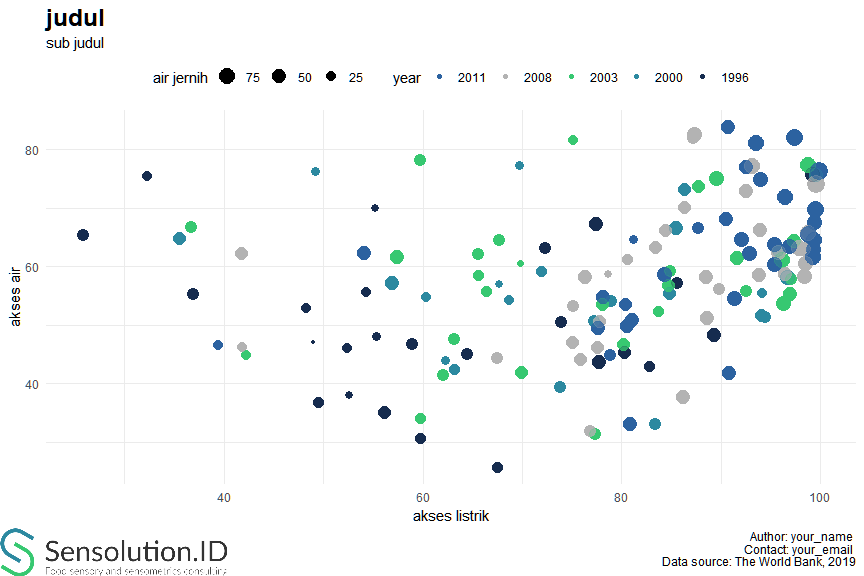

Kostumisasi Tampilan
================
Muhammad Aswan Syahputra

Anda telah berhasil membuat berbagai jenis grafik pada modul 003. Pada
modul ini Anda akan diperkenalkan dengan beberapa cara untuk melakukan
kostumisasi tampilan dan membuat *branding* akan grafik-grafik yang
dibuat. Anda akan menggunakan dataset household\_access untuk membuat
*scatterplot* dalam modul ini.

``` r
load("../data/household_access.rda")
household_access
```

    ##                      province year electricity_total
    ## 1                        Bali 1996          89.36000
    ## 2                    Bengkulu 1996          55.30000
    ## 3               DI Yogyakarta 1996          85.57000
    ## 4                 DKI Jakarta 1996          99.24000
    ## 5                       Jambi 1996          48.28000
    ## 6                  Jawa Barat 1996          82.75000
    ## 7                 Jawa Tengah 1996          80.32000
    ## 8                  Jawa Timur 1996          77.80000
    ## 9            Kalimantan Barat 1996          48.96000
    ## 10         Kalimantan Selatan 1996          64.49000
    ## 11          Kalimantan Tengah 1996          52.59000
    ## 12           Kalimantan Timur 1996          77.43000
    ## 13                    Lampung 1996          32.28000
    ## 14                     Maluku 1996          56.13000
    ## 15   Nanggroe Aceh Darussalam 1996          52.40000
    ## 16        Nusa Tenggara Barat 1996          67.50000
    ## 17        Nusa Tenggara Timur 1996          25.81000
    ## 18                       Riau 1996          55.25000
    ## 19           Sulawesi Selatan 1996          58.96000
    ## 20            Sulawesi Tengah 1996          49.49000
    ## 21          Sulawesi Tenggara 1996          36.90000
    ## 22             Sulawesi Utara 1996          72.32000
    ## 23             Sumatera Barat 1996          59.75000
    ## 24           Sumatera Selatan 1996          54.36000
    ## 25             Sumatera Utara 1996          73.93000
    ## 26                       Bali 2000          96.65000
    ## 27                   Bengkulu 2000          68.66000
    ## 28              DI Yogyakarta 2000          95.81000
    ## 29                DKI Jakarta 2000          99.60000
    ## 30                      Jambi 2000          60.31000
    ## 31                 Jawa Barat 2000          94.14000
    ## 32                Jawa Tengah 2000          94.46000
    ## 33                 Jawa Timur 2000          94.03000
    ## 34           Kalimantan Barat 2000          67.71000
    ## 35         Kalimantan Selatan 2000          77.23000
    ## 36          Kalimantan Tengah 2000          62.30000
    ## 37           Kalimantan Timur 2000          85.54000
    ## 38                    Lampung 2000          49.16000
    ## 39        Nusa Tenggara Barat 2000          83.37000
    ## 40        Nusa Tenggara Timur 2000          35.45000
    ## 41                       Riau 2000          69.76000
    ## 42           Sulawesi Selatan 2000          78.98000
    ## 43            Sulawesi Tengah 2000          63.17000
    ## 44          Sulawesi Tenggara 2000          56.94000
    ## 45             Sulawesi Utara 2000          86.31000
    ## 46             Sumatera Barat 2000          73.82000
    ## 47           Sumatera Selatan 2000          71.90000
    ## 48             Sumatera Utara 2000          84.84000
    ## 49                       Bali 2003          96.16000
    ## 50                     Banten 2003          92.61000
    ## 51                   Bengkulu 2003          65.57000
    ## 52              DI Yogyakarta 2003          97.41000
    ## 53                DKI Jakarta 2003          98.83000
    ## 54                  Gorontalo 2003          59.79000
    ## 55                      Jambi 2003          67.69000
    ## 56                 Jawa Barat 2003          97.13000
    ## 57                Jawa Tengah 2003          97.03000
    ## 58                 Jawa Timur 2003          96.29000
    ## 59           Kalimantan Barat 2003          69.83000
    ## 60         Kalimantan Selatan 2003          84.75000
    ## 61          Kalimantan Tengah 2003          66.37000
    ## 62           Kalimantan Timur 2003          89.59000
    ## 63  Kepulauan Bangka-Belitung 2003          83.70000
    ## 64                    Lampung 2003          59.75000
    ## 65               Maluku Utara 2003          62.05000
    ## 66                     Maluku 2003          69.91000
    ## 67   Nanggroe Aceh Darussalam 2003          84.94000
    ## 68        Nusa Tenggara Barat 2003          77.39000
    ## 69        Nusa Tenggara Timur 2003          36.65000
    ## 70                      Papua 2003          42.22000
    ## 71                       Riau 2003          75.16000
    ## 72           Sulawesi Selatan 2003          78.03000
    ## 73            Sulawesi Tengah 2003          63.19000
    ## 74          Sulawesi Tenggara 2003          57.47000
    ## 75             Sulawesi Utara 2003          87.77000
    ## 76             Sumatera Barat 2003          80.22000
    ## 77           Sumatera Selatan 2003          65.54000
    ## 78             Sumatera Utara 2003          91.70000
    ## 79                       Bali 2008          97.85000
    ## 80                     Banten 2008          96.45000
    ## 81                   Bengkulu 2008          80.57000
    ## 82              DI Yogyakarta 2008          98.80000
    ## 83                DKI Jakarta 2008          99.63000
    ## 84                  Gorontalo 2008          76.90000
    ## 85                      Jambi 2008          84.39000
    ## 86                 Jawa Barat 2008          98.43000
    ## 87                Jawa Tengah 2008          98.47000
    ## 88                 Jawa Timur 2008          98.35000
    ## 89           Kalimantan Barat 2008          78.66000
    ## 90         Kalimantan Selatan 2008          93.84000
    ## 91          Kalimantan Tengah 2008          75.16000
    ## 92           Kalimantan Timur 2008          93.16000
    ## 93  Kepulauan Bangka-Belitung 2008          93.99000
    ## 94             Kepulauan Riau 2008          87.34000
    ## 95                    Lampung 2008          86.27000
    ## 96               Maluku Utara 2008          75.83000
    ## 97                     Maluku 2008          75.06000
    ## 98   Nanggroe Aceh Darussalam 2008          89.83000
    ## 99        Nusa Tenggara Barat 2008          86.17000
    ## 100       Nusa Tenggara Timur 2008          41.71000
    ## 101               Papua Barat 2008          67.48000
    ## 102                     Papua 2008          41.82000
    ## 103                      Riau 2008          87.20000
    ## 104            Sulawesi Barat 2008          77.59000
    ## 105          Sulawesi Selatan 2008          88.53000
    ## 106           Sulawesi Tengah 2008          77.72000
    ## 107         Sulawesi Tenggara 2008          76.34000
    ## 108            Sulawesi Utara 2008          92.59000
    ## 109            Sumatera Barat 2008          88.65000
    ## 110          Sumatera Selatan 2008          83.44000
    ## 111            Sumatera Utara 2008          95.80000
    ## 112                      Bali 2011          98.85030
    ## 113                    Banten 2011          99.27480
    ## 114                  Bengkulu 2011          87.69487
    ## 115             DI Yogyakarta 2011          99.54836
    ## 116               DKI Jakarta 2011          99.94611
    ## 117                 Gorontalo 2011          80.87733
    ## 118                     Jambi 2011          90.50141
    ## 119                Jawa Barat 2011          99.44984
    ## 120               Jawa Tengah 2011          99.40393
    ## 121                Jawa Timur 2011          99.30061
    ## 122          Kalimantan Barat 2011          81.19250
    ## 123        Kalimantan Selatan 2011          95.35492
    ## 124         Kalimantan Tengah 2011          80.35565
    ## 125          Kalimantan Timur 2011          93.59106
    ## 126 Kepulauan Bangka-Belitung 2011          96.48806
    ## 127            Kepulauan Riau 2011          97.34336
    ## 128                   Lampung 2011          92.53250
    ## 129              Maluku Utara 2011          80.60688
    ## 130                    Maluku 2011          77.61531
    ## 131  Nanggroe Aceh Darussalam 2011          95.40907
    ## 132       Nusa Tenggara Barat 2011          90.81084
    ## 133       Nusa Tenggara Timur 2011          54.12466
    ## 134               Papua Barat 2011          78.17528
    ## 135                     Papua 2011          39.39974
    ## 136                      Riau 2011          90.79022
    ## 137            Sulawesi Barat 2011          78.89655
    ## 138          Sulawesi Selatan 2011          92.88205
    ## 139           Sulawesi Tengah 2011          81.07835
    ## 140         Sulawesi Tenggara 2011          84.30793
    ## 141            Sulawesi Utara 2011          93.93872
    ## 142            Sumatera Barat 2011          91.40001
    ## 143          Sumatera Selatan 2011          92.01202
    ## 144            Sumatera Utara 2011          96.92261
    ##     fixed_line_phone_connection safe_sanitation safe_water
    ## 1                      5.284394        48.26000      55.83
    ## 2                      3.857858        48.09000      21.10
    ## 3                      2.023558        57.17000      36.59
    ## 4                     24.317720        75.80000      58.35
    ## 5                      2.872895        52.83000      25.15
    ## 6                      4.276692        43.05000      33.22
    ## 7                      1.837019        45.45000      41.43
    ## 8                      3.449726        43.74000      50.20
    ## 9                      2.753740        47.03000      11.33
    ## 10                     2.560172        45.06000      39.83
    ## 11                     3.856614        38.03000      19.37
    ## 12                     5.278639        67.26000      50.38
    ## 13                     2.382953        75.40000      24.42
    ## 14                     3.024910        35.05000      45.02
    ## 15                     3.071935        45.99000      24.64
    ## 16                     1.410638        25.70000      30.51
    ## 17                     1.544754        65.27000      38.32
    ## 18                     5.438932        70.02000      17.54
    ## 19                     3.393857        46.81000      35.76
    ## 20                     3.407047        36.90000      34.09
    ## 21                     2.254212        55.30000      37.12
    ## 22                     3.718045        63.04000      36.45
    ## 23                     3.667823        30.65000      32.80
    ## 24                     3.508741        55.57000      28.94
    ## 25                     2.907681        50.44000      41.14
    ## 26                    10.365270        58.19000      63.42
    ## 27                     5.658091        54.26000      25.01
    ## 28                     3.706765        62.58000      37.74
    ## 29                    43.873410        75.57000      52.59
    ## 30                     3.661808        54.83000      26.68
    ## 31                     8.930526        55.39000      25.05
    ## 32                     3.329930        51.30000      39.82
    ## 33                     6.075574        51.61000      42.71
    ## 34                     4.311060        57.00000      18.46
    ## 35                     4.506245        50.65000      40.72
    ## 36                     5.627451        43.93000      21.75
    ## 37                    11.775890        66.51000      50.53
    ## 38                     2.950404        76.32000      22.18
    ## 39                     2.021291        33.09000      35.91
    ## 40                     2.149188        64.75000      45.42
    ## 41                     7.521782        77.33000      20.97
    ## 42                     5.520475        54.13000      39.46
    ## 43                     3.529012        42.51000      34.46
    ## 44                     2.982315        57.12000      48.82
    ## 45                     5.558373        73.13000      43.95
    ## 46                     5.175862        39.40000      37.76
    ## 47                     4.732908        59.11000      31.87
    ## 48                     4.562189        55.38000      46.21
    ## 49                    16.016810        61.03000      70.59
    ## 50                    16.191180        55.85000      40.29
    ## 51                     6.923007        58.45000      31.02
    ## 52                     6.182881        64.36000      53.43
    ## 53                    50.313420        77.23000      70.30
    ## 54                     4.196589        34.14000      31.10
    ## 55                     5.943143        64.54000      35.08
    ## 56                    11.906370        57.90000      39.52
    ## 57                     4.842316        55.35000      50.67
    ## 58                     9.909898        53.67000      58.19
    ## 59                     6.706896        60.56000      16.07
    ## 60                     6.359066        56.74000      43.85
    ## 61                     9.956327        55.84000      33.33
    ## 62                    17.606660        75.06000      57.34
    ## 63                     8.159733        52.36000      32.20
    ## 64                     4.688775        78.16000      39.96
    ## 65                     3.905863        41.50000      38.00
    ## 66                     6.882465        41.92000      47.65
    ## 67                     6.002328        59.25000      37.97
    ## 68                     2.298279        31.33000      36.35
    ## 69                     2.621175        66.75000      37.82
    ## 70                     8.353290        44.85000      28.33
    ## 71                    10.770210        81.50000      28.13
    ## 72                     8.951183        53.53000      45.82
    ## 73                     6.499804        47.58000      39.41
    ## 74                     4.085022        61.61000      51.41
    ## 75                     8.984269        73.64000      48.29
    ## 76                     9.834025        46.72000      45.48
    ## 77                     8.256568        62.12000      40.94
    ## 78                     9.538561        61.47000      53.09
    ## 79                    15.334330        63.17000      74.57
    ## 80                    18.611620        58.66000      53.89
    ## 81                     7.995992        61.16000      31.31
    ## 82                     8.363121        65.67000      69.61
    ## 83                    58.882060        74.03000      87.77
    ## 84                     5.386177        31.82000      41.29
    ## 85                     7.512189        66.24000      46.89
    ## 86                    13.933890        62.92000      50.41
    ## 87                     5.786231        60.53000      58.09
    ## 88                    11.632960        58.42000      65.16
    ## 89                     9.249138        58.67000      19.44
    ## 90                     6.601326        58.56000      54.00
    ## 91                    11.048260        53.29000      35.46
    ## 92                    19.195630        77.03000      67.51
    ## 93                     6.238063        66.11000      54.03
    ## 94                    23.150160        82.54000      56.82
    ## 95                     5.532863        70.19000      45.01
    ## 96                     4.851528        44.21000      41.82
    ## 97                     7.323211        47.15000      46.92
    ## 98                     3.809539        56.05000      41.23
    ## 99                     3.435481        37.76000      50.00
    ## 100                    4.068502        62.23000      45.13
    ## 101                   44.306870        44.32000      40.00
    ## 102                    4.215908        46.27000      27.83
    ## 103                    5.971784        81.88000      41.02
    ## 104                    2.604008        46.14000      44.91
    ## 105                   12.303680        58.20000      53.97
    ## 106                    6.121032        50.58000      45.74
    ## 107                    5.528162        58.15000      56.04
    ## 108                   11.054280        72.76000      52.27
    ## 109                   11.145750        51.18000      49.51
    ## 110                    9.250443        63.31000      48.23
    ## 111                   12.023030        62.49000      58.47
    ## 112                   15.125320        65.49347      80.06
    ## 113                   11.578410        62.91877      62.64
    ## 114                    6.176828        66.57481      40.19
    ## 115                    8.926727        69.81715      75.39
    ## 116                   40.032680        76.29714      91.54
    ## 117                    2.273602        33.06126      50.88
    ## 118                    3.569099        68.12445      53.25
    ## 119                    9.513000        67.59676      59.52
    ## 120                    4.831265        64.51502      66.26
    ## 121                    7.100614        61.62557      70.06
    ## 122                    5.306684        64.67778      23.92
    ## 123                    5.281530        63.79598      60.27
    ## 124                    4.960361        53.60374      45.88
    ## 125                   17.198820        80.95854      75.21
    ## 126                    4.758069        71.74828      74.14
    ## 127                   15.291540        82.03834      83.57
    ## 128                    2.840973        76.97665      50.48
    ## 129                    2.092365        49.86953      48.87
    ## 130                    5.069375        49.53769      54.01
    ## 131                    1.456130        60.34071      59.10
    ## 132                    2.296192        41.85099      55.04
    ## 133                    3.460968        62.34567      50.25
    ## 134                    3.418762        54.82798      50.73
    ## 135                    2.713203        46.54237      27.45
    ## 136                    4.182975        83.81155      51.16
    ## 137                    2.340470        44.85735      39.34
    ## 138                    8.488988        62.29252      61.98
    ## 139                    4.920291        50.88930      51.61
    ## 140                    3.239963        58.63703      61.59
    ## 141                    5.199396        74.87753      62.09
    ## 142                   22.385380        54.65506      59.11
    ## 143                    7.076218        64.58648      57.37
    ## 144                    7.806285        63.42006      64.84

Selanjutnya Anda diminta untuk mengaktifkan paket ggplot2, magick, dan
grid. Isilah bagian \_\_\_ dengan jawaban yang tepat\!

``` r
library(ggplot2)
library(magick)
library(grid)
```

Dengan menggunakan dataset household\_access, buatlah *scatterplot*
dengan nama plot\_household berdasarkan kriteria berikut:

1.  Sumbu x: electricity\_total
2.  Sumbu y: safe\_sanitation
3.  *Aesthetic mapping size*: safe\_water
4.  *Aesthetic mapping colour*: year

<!-- end list -->

``` r
plot_household <- 
  household_access %>% 
  ggplot(aes(x = electricity_total, y = safe_sanitation, size = safe_water, colour = year)) +
  geom_point()
plot_household
```


Pada grafik tersebut nampak banyak titik-titik observasi yang menumpuk.
Perbakilah hal tersebut dengan mengatur nilai argumen `alpha` dalam
baris kode `geom_point()`. Anda dapat bereksperimen mencari visual yang
sesuai dengan menggunakan nilai alpha antara 0 hingga 1. Selain itu
gantilah palet warna dari *aesthetic mapping colour* dengan menambahkan
kode warna (*hexvalue*): “\#162c4f”, “\#2c89a0”, “\#37c871”, “\#b3b3b3”,
dan “\#2c62a0” ke baris kode `scale_color_manual()`. Simpan grafik hasil
modifikasi Anda tersebut dalam obyek R dengan nama plot\_household
seperti sebelumnya\!

``` r
plot_household <- 
  plot_household +
  geom_point(alpha = 0.3) +
  scale_colour_manual(values = c("#162c4f",
                                 "#2c89a0",
                                 "#37c871",
                                 "#b3b3b3",
                                 "#2c62a0"))
plot_household
```


Sekarang grafik tersebut nampak lebih baik dengan diperbaikinya
titik-titik data yang menumpuk dan pergantian palet warna. Anda juga
dapat menggunakan palet warna lain, misalnya `scale_colour_brewer()`
atau `scale_colour_viridis()` dari paket viridis. Jika diperhatikan
dengan saksama, Anda dapat menyaksikan bahwa penamaan obyek pada legenda
ditulis terbalik (contoh pada safe\_water 25 ditulis paling atas,
kemudian, 50, terakhir 70). Anda dapat memperbaiki hal tersebut dengan
mengatur nilai pada argumen `reverse` pada baris kode `guides()` menjadi
TRUE\!

``` r
plot_household <- 
  plot_household +
  guides(size = guide_legend(reverse = TRUE, order = 1),
         colour = guide_legend(reverse = TRUE, order = 2 ))
plot_household
```


Selanjutnya Anda diminta untuk mengganti judul, subjudul, label sumbu x
dan y, judul legenda, serta menambahkan *caption* untuk mensitir
penyedia data yaitu The World Bank tahun 2019. Anda dapat melakukannya
dengan menambahkan baris kode `labs()` pada obyek grafik
plot\_household.

``` r
plot_household <- 
  plot_household +
  labs(
    title = "judul",
    subtitle = "sub judul",
    caption = "Author: your_name \n Contact: your_email \n Data source: The World Bank, 2019",
    x = "akses listrik",
    y = "akses air",
    colour = "year",
    size = "air jernih"
  )
plot_household
```


Grafik tersebut sekarang sudah nampak lebih baik bukan? Namun Anda masih
dapat melakukan kostumisasi tampilan lebih jauh dengan cara menggunakan
*preset theme* (fungsi `theme_*()`) dan/atau bahkan berkreasi dengan
menggunakan fungsi `theme()`. Pada *chunk* berikut kita akan
memanfaatkan *preset theme* bernama *theme\_minimal* dan menambahkan
sedikit kostumisasi melalui fungsi `theme()`. Ubahlah posisi legenda
menjadi ke bawah dengan mengganti nilai dari argumen `legend.position`\!

``` r
plot_household <- 
  plot_household +
  theme_minimal() +
  theme(
    text = element_text(family = "Lato"),
    plot.title = element_text(face = "bold", size = 18),
    legend.position = "top"
  )
plot_household
```


Selamat Anda telah sukses melakukan kostumisasi tampilan grafik\!
Sekarang Anda dapat menyimpan grafik tersebut dengan menggunakan fungsi
`ggsave()` seperti contoh
berikut:

``` r
ggsave("household_access.png", plot_household, width = 20, height = 10, units = "cm")
```

Anda dapat menyimpan grafik dalam format png, pdf, svg, wmf. Selain itu
Anda juga dapat mengatur ukuran serta resolusi dari grafik yang akan
disimpan.

Selanjutnya pada *chunk* berikut akan ditunjukan salah satucara untuk
menambahkan logo Anda atau logo perusahaan ke dalam grafik
plot\_household.

``` r
logo <- image_read("../data-raw/sensolutionid.png") # berkas logo dengan format png atau jpg
plot_household
grid::grid.raster(logo, x = 0.0, y = 0.0, just = c('left', 'bottom'), height = unit(0.5, 'inches'))
```



Tuliskan kembali baris kode pada *chunk* di atas namun gantilah alamat
berkas logo menjadi
“../data-raw/telkom-university.png”\!

``` r
logo <- image_read("../data-raw/telkom-university.png") # berkas logo dengan format png atau jpg
plot_household
grid::grid.raster(logo, x = 0.0, y = 0.0, just = c('left', 'bottom'), height = unit(0.5, 'inches'))
```


Selain dengan menggunakan *preset theme* dari ggplot2 atau meracik tema
sendiri, Anda juga dapat menggunakan paket-paket R yang menyediakan tema
untuk ggplo2. Diantaranya adalah paket hrbrthemes ggpubr dan paket
ggthemr. Pada modul selanjutnya Anda akan belajar menggunakan salahsatu
tema dari paket tersebut. Namun sebelumnya, dapatkah Anda menambahkan
baris kode `facet_warp(~year)` pada plot\_household? Apakah yang akan
terjadi pada grafik tersebut?

``` r
plot_household +
facet_wrap(~year)
```


