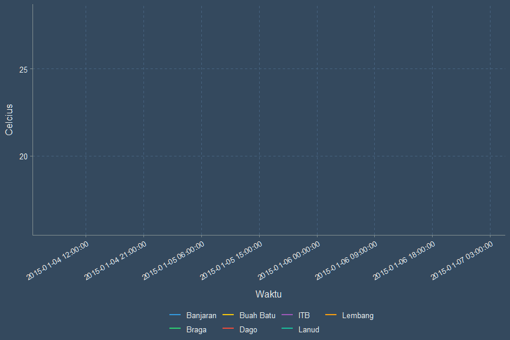

Animasi dari Grafik
================
Muhammad Aswan Syahputra

Pembuatan animasi dari grafik statis yang diolah menggunakan paket
ggplot2 dapat dilakukan dengan menggunakan paket gganimate. Anda
dipersilahkan untuk mengaktifkan kedua paket tersebut dengan mengisi
bagian \_\_\_ berikut dengan jawaban yang tepat. Selain itu dalam modul
ini kita akan menggunakan tema flat dark dari paket ggthemr (paket
ggthemr dapat dipasang dengan menjalankan fungsi
`remotes::install_github('cttobin/ggthemr')`).

``` r
library(ggplot2)
library(gifski)
library(gganimate)
library(ggthemr) # Dipasang dengan cara menjalankan kode: remotes::install_github('cttobin/ggthemr')
ggthemr("flat dark", type = "outer") # Anda juga dapat menggunakan tema lain. Pilihan tema dapat dilihat di https://github.com/cttobin/ggthemr#palettes
```

Anda akan menggunakan dataset weather yang memiliki informasi mengenai
data cuaca di beberapa lokasi di area Bandung. Dataset tersebut
tersimpan pada direktori data-raw dengan nama weather.rda. Pergunakan
fungsi `load()` untuk mengimpor dataset tersebut menjadi obyek R dengan
nama weather dan kemudian pelajarilah strukturnya. Ada berapa lokasi dan
variabel cuaca yang terdapat dalam dataset tersebut? Kapan observasi
tersebut dimulai dan diakhiri?

``` r
load("../data/weather.rda")
weather
```

    ## # A tibble: 476 x 5
    ##    location time                temperature pressure windspeed
    ##    <chr>    <dttm>                    <dbl>    <dbl>     <dbl>
    ##  1 Lembang  2015-01-04 07:00:00        20.7    1011.     0.774
    ##  2 Lembang  2015-01-04 08:00:00        17.5    1013.     4.49 
    ##  3 Lembang  2015-01-04 09:00:00        18.1    1012.     6.63 
    ##  4 Lembang  2015-01-04 10:00:00        17.5    1012.     9.62 
    ##  5 Lembang  2015-01-04 11:00:00        18.8    1011.    10.1  
    ##  6 Lembang  2015-01-04 12:00:00        19.2    1011.     8.71 
    ##  7 Lembang  2015-01-04 13:00:00        19.3    1011.     8.37 
    ##  8 Lembang  2015-01-04 14:00:00        19.1    1011.     7.79 
    ##  9 Lembang  2015-01-04 15:00:00        19.6    1011.     9.34 
    ## 10 Lembang  2015-01-04 16:00:00        19.2    1011.     7.76 
    ## # ... with 466 more rows

``` r
dim(weather)
```

    ## [1] 476   5

``` r
str(weather)
```

    ## Classes 'spec_tbl_df', 'tbl_df', 'tbl' and 'data.frame': 476 obs. of  5 variables:
    ##  $ location   : chr  "Lembang" "Lembang" "Lembang" "Lembang" ...
    ##  $ time       : POSIXct, format: "2015-01-04 07:00:00" "2015-01-04 08:00:00" ...
    ##  $ temperature: num  20.7 17.5 18.1 17.5 18.8 ...
    ##  $ pressure   : num  1011 1013 1012 1012 1011 ...
    ##  $ windspeed  : num  0.774 4.49 6.629 9.621 10.063 ...

Sekarang buatlah *line graph* untuk mengamati pola perubahan suhu
terhadap waktu dengan menggunakan ggplot2 dan simpan hasilnya ke dalam
obyek R bernama plot\_temperature\! Pergunakan warna garis yang berbeda
untuk setiap lokasi dan atur semua ketebalan garis menjadi 0.8.

``` r
plot_temperature <- 
  ggplot(weather, aes(x = time, y = temperature, colour = location)) +
  geom_line(lwd = 0.8)
plot_temperature
```


Pada grafik di atas, label pada sumbu x hanya menunjukan informasi
tanggal. Perbaikilah label tersebut dengan menambahkan kode
`scale_x_datetime(date_breaks = "9 hours")` pada plot\_temperature serta
ubahlah posisi *legend* menjadi di bawah. Kemudian gantilah judul label
sumbu x menjadi ‘Waktu’ dan sumbu y menjadi ‘Suhu (Celcius)’ serta hapus
judul pada *legend*. Jangan lupa untuk menyimpan grafik yang sudah Anda
modifikasi tersebut dengan nama plot\_temperature (Petunjuk: fungsi
`theme()` dan `labs()`).

``` r
plot_temperature <- 
  plot_temperature +
  scale_x_datetime(date_breaks = "9 hours") +
  theme(
    axis.text.x = element_text(angle = 30, hjust = 1, vjust = 1),
    legend.position = "bottom"
  ) +
  labs(
    x = "Waktu",
    y = "Celcius",
    colour = NULL
  )
plot_temperature
```


Sekarang Anda dapat mengubah grafik statis diatas menjadi animasi dengan
menggunakan fungsi dari paket gganimate. Apa yang akan terjadi jika Anda
menambahkan baris kode `transition_reveal(time)` pada plot\_temperature?

``` r
plot_temperature +
  transition_reveal(time)
```



Selamat Anda telah berhasil membuat animasi pertama dari grafik
menggunakan paket ggplot2 dan gganimate\! Anda dapat berkesperimen
membuat animasi serupa dengan menggunakan variabel pressure atau
windspeed dari dataset weather tersebut.

Selanjutnya Anda akan menggunakan dataset yang sama untuk membuat
*scatterplot* antara suhu dan tekanan udara. Selain itu Anda juga
diminta untuk menambahkan informasi lokasi (*aesthetic colour*) dan
kecepatan angin (*aesthetic size*) ke dalam grafik tersebut. Anda dapat
menamakan grafik tersebut dengan nama
plot\_weather.

``` r
plot_weather <- ggplot(weather, aes(x = time, y = pressure, colour = location, size = 0.5)) +
  geom_point()
plot_weather
```


Anda telah berhasi membuat *scatterplot* dasar antara tekanan dan suhu.
Pada grafik tersebut terjadi *overplotting* dikarenakan penumpukan data
observasi dari berbagai lokasi. Selanjutnya Anda diminta untuk membuat
animasi yang menampilkan *scatterplot* setiap lokasi secara bergiliran.
Pada *chunk* berikut dilakukan beberapa kostumisasi pada grafik sebelum
dilakukan pembuatan animasi. Salah satu kostumisasi terpenting adalah
menghapus legenda location dari grafik dan mengatur posisi legenda
windspeed. Isilah bagian \_\_\_ pada `colour = ___` menjadi TRUE serta
isilah argumen `legend.position = c(___, ___)` dengan angka 0.9 dan
0.8\!

``` r
plot_weather <- 
  plot_weather +
  scale_size_area() +
  guides(colour = FALSE) +
  theme(
    legend.position = c(0.9,0.8)
  )
plot_weather
```


Sekarang Anda dapat membuat animasi dengan menggunakan fungsi
`transition_states()` dari paket gganimate. Fungsi tersebut digunakan
untuk membuat animasi yang membagi data menjadi beberapa kondisi, mirip
dengan fungsi `facet_wrap()` untuk grafik statis. Isilah bagian \_\_\_
dengan nama variabel dari dataset weather yang menunjukan lokasi
pengamatan untuk membuat animasi dengan nama animate\_weather\!

``` r
animate_weather <- 
  plot_weather  +
  transition_states(location) +
  ease_aes('cubic-in-out') +
  enter_grow() +
  exit_shrink()
animate_weather
```


Selamat Anda kembali berhasil membuat animasi dari grafik statis\! Anda
dapat menyempurnakan animasi tersebut dengan menambahkan judul grafik,
sub-judul grafik, judul legenda, label sumbu x, dan label sumbu y.
Isilah bagian \_\_\_ dengan judul yang menurut Anda sesuai dan jangan
lupa mengisi nama Anda pada bagian `caption`\!

``` r
animate_weather <- 
  animate_weather +
  labs(
    x = "___",
    y = "___",
    title = "___",
    subtitle = "Lokasi pengamatan: {closest_state}",
    caption = "Grafik ini dibuat oleh ___",
    size = "___"
  )
animate_weather
```


